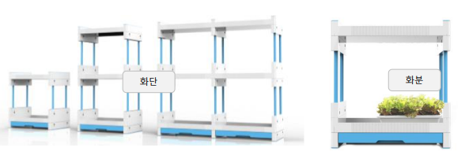

# 데이터베이스 프로젝트 시작 (22/11/28)

11/28

+ 주어진 스토리보드에 맞는 데이터 베이스 설계
+ 설계된 데이터베이스 대하여 보고서 작성
   + 보고서 내 필요한 내용
      + 학번 이름 필수
      + 서비스 분석
      + ER 다이어그램
      + IE 표기법
      + 설계 테이블, 프로시저, 함수, 트리거 설명
      + 각 화면에서 사용될 SQL 문
      + 설계 검증
      + 고찰

## 서비스할 제품의 구성

> IoT 실내공장관리 App
실내 공장 관리 서비스로써 사용자들이 모바일을 통해 제어 및 관리 할 수 있다.

+ 고객은 여러 대의 IoT 디바이스를 구매하여 관리할 수 있다.
+ 제품은 화단과 화분으로 구성되며 화단은 여러 개의 화분을 포함한다.
+ 화단은 수조, 산소공급기, UV램프를 관리한다.
+ 화분은 온도, 습도와, 수분량을 모니터링하며, 히터, 팬, 가습기, 조명, 물공급을 제어한다.

## 요구사항 분석

1. IoT 앱을 사용하려면 고객의 회원가입이 필요하다.
가입을 위해서는 고객의 이름, 이메일 주소, 비밀번호가 필요함.
2. **고객은 여러 대의 IoT 디바이스 제품을 구매하여 관리** 할 수 있다. 제품에는 **화단과 화분**으로 구성되있다.
3. **화단은 여러 개의 화분**을 포함한다.
   + 화단은 **수조, 산소공급기, UV램프를 관리**한다.
   + 화단 추가 시 화단코드와 화단 이름이 필요하다.
   + 화단 재배 설정에 필요한 기능이다.
      + 자동재배 기능(On , Off)
      + 수조밸브 최소,최대 길이 설정 기능
      + 산소 공급기의 동작주기, 시간 설정 기능
      + UV 램프의 동작주기, 시간 설정 기능
4. 화분은 **히터, 팬, 가습기, 조명, 물공급을 제어**한다.
   + 화분의 조회기간을 검색하여 해당 날짜의 온도, 습도와 수분량의 조회 기능이 필요하다.
   + 화분 추가 시 화분 코드, 화분 이름, 식물 종류, 심은 날짜가 필요하다.
   + 화분 재배 설정에 필요한 기능이다.
      + 자동재배 기능(On, Off)
      + 화분의 최소,최대 온도 설정 기능
      + 습도의 최소,최대 온도 설정 기능
      + 조도의 켜지는 시각,꺼지는 시각 설정 기능
      + 조도의 동작조도, 동작주기, 동작시간 설정 기능