# 데이터베이스 프로젝트 시작 (22/11/28)


## 11/28

+ 주어진 스토리보드에 맞는 데이터 베이스 설계
+ 설계된 데이터베이스 대하여 보고서 작성
   + 보고서 내 필요한 내용
      + 학번 이름 필수
      + 서비스 분석
      + ER 다이어그램
      + IE 표기법
      + 설계 테이블, 프로시저, 함수, 트리거 설명
      + 각 화면에서 사용될 SQL 문
      + 설계 검증
      + 고찰

### 서비스할 제품의 구성


> IoT 실내공장관리 App
실내 공장 관리 서비스로써 사용자들이 모바일을 통해 제어 및 관리 할 수 있다.

+ 고객은 여러 대의 IoT 디바이스를 구매하여 관리할 수 있다.
+ 제품은 화단과 화분으로 구성되며 화단은 여러 개의 화분을 포함한다.
+ 화단은 수조, 산소공급기, UV램프를 관리한다.
+ 화분은 온도, 습도와, 수분량을 모니터링하며, 히터, 팬, 가습기, 조명, 물공급을 제어한다.

### 서비스(요구사항) 분석

1. IoT 앱을 사용하려면 고객의 회원가입이 필요하다.
가입을 위해서는 **고객의 이름, 이메일 주소, 비밀번호**가 필요함.
2. **고객은 여러 대의 IoT 디바이스 제품을 구매하여 관리** 할 수 있다. 제품에는 **화단과 화분**으로 구성되있다.
3. **화단은 여러 개의 화분**을 포함한다.
   + 화단은 **수조, 산소공급기, UV램프를 관리**한다.
   + 화단 추가 시 화단코드와 화단 이름이 필요하다.
   + 화단 재배 설정에 필요한 기능이다.
      + 자동재배 기능(On , Off)
      + 수조밸브 최소,최대 길이 설정 기능
      + 산소 공급기의 동작주기, 시간 설정 기능
      + UV 램프의 동작주기, 시간 설정 기능
4. 화분은 **히터, 팬, 가습기, 조명, 물공급을 제어**한다.
   + 화분의 조회기간을 검색하여 해당 날짜의 온도, 습도와 수분량의 조회 기능이 필요하다.
   + 화분 추가 시 화분 코드, 화분 이름, 식물 종류, 심은 날짜가 필요하다.
   + 화분 재배 설정에 필요한 기능이다.
      + 자동재배 기능(On, Off)
      + 화분의 최소,최대 온도 설정 기능
      + 습도의 최소,최대 온도 설정 기능
      + 조도의 켜지는 시각,꺼지는 시각 설정 기능
      + 조도의 동작조도, 동작주기, 동작시간 설정 기능


## 12/06

### E-R 다이어그램 작성

스토리보드를 토대로 E-R 다이어그램을 작성했다.


### IE 표기법


## 12/15 

### 설계 DB 설명

+ #### `Customer` 테이블
1. 유저 `Table` 에는 **회원번호(Pk)**, **이름, 이메일, 비밀번호** 컬럼이 존재한다. 여기서 중요한 것은, **이메일의 필드는 중복이 허용되지 않아야한다.**
  + 설계한 컬럼 명 및 데이터 타입
    + `CustomerID(PK)` : **INT**
    + `Email` : **VARCHAR(50)**
    + `Name` : **VARCHAR(20)**
    + `Passwd` : **VARCHAR(20)**
+ #### `FlowerBed` 테이블
1. 화단 `Table` 에는 **화단코드(Pk)**, **회원번호(Fk)**, 화단이름 컬럼이 존재하며 유저 테이블과 1 : N 관계를 갖고 있다.
+ 설계한 컬럼 명 및 데이터 타입
    + `FlowerBedID(PK)` : **INT**
    + `cust_ID(FK)` : **INT**
    + `FloewrBedName` : **VARCHAR(15)**
2. 즉 **1명의 유저가 여러개의 화단을 구매할 수 있다는 것**이다.

+ #### `FlowerBed_ControlInfo` 테이블
1. 화단 제어 정보 `Table`에는 **제어 ID(Pk)** ,**화단코드(Fk)**, 수조 밸브 조작 여부와 조작 날짜, UV 램프 조작 여부와 조작 날짜, 산소 공급기 조작 여부와 조작 날짜 컬럼이 존재한다. 조작 날짜 컬럼의 존재 이유는 유저에게 마지막으로 조작(업데이트)한 날짜를 알려주기 위함이다.
+ 설계한 컬럼 명 및 데이터 타입
    + `BedControlSetID(PK)` : **INT**
    + `Flowerbed_BedID_fk(FK)` : **INT**
    + `Valve_Info` : **INT(1)**
    + `Valve_ControlDATE` : **DATETIME** (값 설정 시 년,원,일,시,분,초 까지 들어가도록 설정하기 위해서다.)
    + `UV_Ramp_Info` : **INT(1)**
    + `UVRamp_ControlDATE` : **DATETIME**
    + `AirSupply_Info` : **INT(1)**
    + `AirSupply_ControlDATE` : **DATETIME**
2. **화단 제어 정보 테이블은 화단 테이블과 1 : N 관계를 갖고 있다. 1개의 화단은 화단 제어 정보 여러 개를 가질 수 있는 것**이다.

+ #### `FlowerBed_PlantSetting` 테이블

1. 화단 재배 설정 `Table`에는 **설정 ID(Pk)**, **화단 코드(Fk)**, 자동 재배 여부(Boolean), UV램프의 동작주기와 시간, 산소공급기의 동작주기와 시간, 수조 밸브의 최소 최대 길이 컬럼이 존재한다.
+ 설계한 컬럼 명 및 데이터 타입
    + `BedSettingID(PK)` : **INT**
    + `Bed_ID_fk(FK)` : **INT**
    + `AutoPlant` : **INT(1)** (값 설정 시 ON,OFF 여부를 DB에 저장하기 위해 0,1 값으로만 들어가도록 설정했다.)
    + `Valve_MIN` : **INT**
    + `Valve_MAX` : **INT**
    + `AirCycle_MIN` : **INT**
    + `AirCycle_MAX` : **INT**
    + `UVRampCycle_MIN` : **INT**
    + `UVRampCycle_MAX` : **INT**
2. 화단 재배 설정 테이블은 화단 테이블과 1 : 1 관계를 갖고 있다. **화단 한 개마다 화단 제어 재배 설정 정보는 하나만 존재**할 수 있다.

+ #### `FlowerPot` 테이블
1. 화분 `Table` 에는 **화분코드(Pk)**, **화단 코드(Fk)**, 화분 이름, 식물 종류, 심은 날짜 컬럼이 존재한다. 화분 테이블은 화단 테이블과 N : 1 관계이다.
+ 설계한 컬럼 명 및 데이터 타입
    + `FlowerPotID(PK)` : **INT**
    + `bed_ID(FK)` : **INT**
    + `FloewrName` : **VARCHAR(20)**
    + `FlowerRegDate` : **DATE**
    + `Plant_Type` : **INT(3)** (식물 종류는 총 3가지 이므로 사용자로부터 입력시 DB에서는 0,1,2 로 인식하도록 했다.)
2. **화단 하나에 여러 개의 화분이 존재할 수 있다. 반대로 화분 하나는 여러 대의 화단을 가질 수 없다.**

+ #### `FlowerPot_ControlInfo` 테이블
1. 화분 제어 정보 `Table`에는 **제어 ID(Pk)**, **화분 코드(Fk)**, 물 공급 여부, LED 조작 여부, 가습기 조작 여부, 히터 조작 여부, 팬 조작 여부 (전부 Boolean) 컬럼이 존재한다.
+ 설계한 컬럼 명 및 데이터 타입
    + `PotControlSetID(PK)` : **INT**
    + `potID_fk(FK)` : **INT**
    + `WaterSupply_Info` : **INT(1)**
    + `WaterSupply_ControlDATE` : **DATETIME**
    + `Heater_Info` : **INT(1)**
    + `Heater_ControlDATE` : **DATETIME**
    + `Humidifier_Info` : **INT(1)**
    + `Humidifier_ControlDATE` : **DATETIME**
    + `LED_Info` : **INT(1)**
    + `LED_ControlDATE` : **DATETIME**
    + `Fan_Info` : **INT(1)**
    + `Fan_ControlDATE` : **DATETIME**
2. 이 역시 화단 테이블과 1 : N 관계를 갖고 있다. 화단 하나에 제어 정보 여러개를 가질 수 있다.

+ #### `FlowerPot_PlantSetting` 테이블
1. 화분 제배 정보 `Table`에는 **설정 ID(Pk)**, **화분 코드(Fk)**, 자동 재배 여부(Boolean), 최소 최대 온도, 최소 최대 습도, 조도의 켜지는 시각과 꺼지는 시각, 동작 조도, 동작 주기와 시간 컬럼이 존재한다.
+ 설계한 컬럼 명 및 데이터 타입
    + `PotSettingID(PK)` : **INT**
    + `pot_ID(FK)` : **INT**
    + `AutoPlant` : **INT(1)**
    + `Temperature_MIN` : **INT**
    + `Temperature_MAX` : **INT**
    + `Humidity_MIN` : **INT**
    + `Humidity_MAX` : **INT**
    + `IlluminationTime_ON` : **DATE** (조도의 ON,OFF 설정 시간은, 시,분 단위기 때문에 DATE 데이터타입으로 지정했다.)
    + `IlluminationTime_OFF` : **DATE**
    + `Lux_Value` : **INT**
    + `Cycle_Min` : **INT**
    + `Cycle_Sec` : **INT**
2. **화단 재배 설정 테이블과 화단 테이블은 1 : 1 관계를 가질 수 있으며 화단 하나에 재배 설정이 하나만 존재**할 수 있다.

### 테이블 생성 SQL 문

상기의 내용으로 테이블을 생성하는 SQL 문이다.

```sql
-- -----------------------------------------------------
-- Schema mydb
-- -----------------------------------------------------
-- -----------------------------------------------------
-- Schema iotservice
-- -----------------------------------------------------

-- -----------------------------------------------------
-- Schema iotservice
-- -----------------------------------------------------
CREATE SCHEMA IF NOT EXISTS `iotservice` DEFAULT CHARACTER SET utf8mb3 ;
USE `iotservice` ;

-- -----------------------------------------------------
-- Table `iotservice`.`customer`
-- -----------------------------------------------------
CREATE TABLE IF NOT EXISTS `iotservice`.`customer` (
  `CustomerID` INT NOT NULL AUTO_INCREMENT,
  `Email` VARCHAR(50) NOT NULL COMMENT '고객메일',
  `Name` VARCHAR(20) NOT NULL COMMENT '고객성명',
  `Passwd` VARCHAR(20) NOT NULL COMMENT '패스워드',
  PRIMARY KEY (`CustomerID`),
  UNIQUE INDEX `CustomerID_UNIQUE` (`CustomerID` ASC) VISIBLE,
  UNIQUE INDEX `Email_UNIQUE` (`Email` ASC) VISIBLE)
ENGINE = InnoDB
AUTO_INCREMENT = 15
DEFAULT CHARACTER SET = utf8mb3;


-- -----------------------------------------------------
-- Table `iotservice`.`flowerbed`
-- -----------------------------------------------------
CREATE TABLE IF NOT EXISTS `iotservice`.`flowerbed` (
  `FlowerBedID` INT NOT NULL,
  `cust_ID` INT NOT NULL,
  `FlowerBedName` VARCHAR(15) NOT NULL COMMENT '화단이름',
  PRIMARY KEY (`FlowerBedID`),
  INDEX `fk_flowerbed_customer1_idx` (`cust_ID` ASC) VISIBLE,
  CONSTRAINT `fk_flowerbed_customer1`
    FOREIGN KEY (`cust_ID`)
    REFERENCES `iotservice`.`customer` (`CustomerID`))
ENGINE = InnoDB
DEFAULT CHARACTER SET = utf8mb3;


-- -----------------------------------------------------
-- Table `iotservice`.`flowerbed_controlinfo`
-- -----------------------------------------------------
CREATE TABLE IF NOT EXISTS `iotservice`.`flowerbed_controlinfo` (
  `BedControlSetID` INT NOT NULL AUTO_INCREMENT COMMENT '화단 제어 ID',
  `flowerbed_BedID_fk` INT NOT NULL COMMENT '화단고유ID',
  `Valve_Info` INT NULL DEFAULT NULL COMMENT '수조밸브설정',
  `Valve_ControlDATE` TIMESTAMP NOT NULL DEFAULT CURRENT_TIMESTAMP COMMENT '밸브설정날짜',
  `UV_Ramp_Info` INT NULL DEFAULT NULL COMMENT 'UV램프설정',
  `UVRamp_ControlDATE` TIMESTAMP NOT NULL DEFAULT CURRENT_TIMESTAMP COMMENT 'UV램프설정날짜',
  `AirSupply_Info` INT NULL DEFAULT NULL COMMENT '산소공급기설정',
  `AirSupply_ControlDATE` TIMESTAMP NOT NULL DEFAULT CURRENT_TIMESTAMP COMMENT '산소공급기설정날짜',
  PRIMARY KEY (`BedControlSetID`),
  INDEX `FlowerBedID_idx` (`flowerbed_BedID_fk` ASC) VISIBLE,
  CONSTRAINT `bed_ID`
    FOREIGN KEY (`flowerbed_BedID_fk`)
    REFERENCES `iotservice`.`flowerbed` (`FlowerBedID`)
    ON DELETE CASCADE
    ON UPDATE CASCADE)
ENGINE = InnoDB
AUTO_INCREMENT = 2
DEFAULT CHARACTER SET = utf8mb3;


-- -----------------------------------------------------
-- Table `iotservice`.`flowerbed_plantsetting`
-- -----------------------------------------------------
CREATE TABLE IF NOT EXISTS `iotservice`.`flowerbed_plantsetting` (
  `BedSettingID` INT NOT NULL AUTO_INCREMENT,
  `Bed_ID_fk` INT NOT NULL,
  `AutoPlant` INT NOT NULL COMMENT '자동재배여부',
  `Valve_MIN` INT NOT NULL COMMENT '밸브최소길이값',
  `Valve_MAX` INT NOT NULL COMMENT '밸브최대길이값',
  `AirCycle_Min` INT NOT NULL COMMENT '산소공급기동작주기값',
  `AirCycle_Sec` INT NOT NULL COMMENT '산소공급기동작시간값',
  `UVRampCycle_Min` INT NOT NULL COMMENT 'UV램프동작주기값',
  `UVRampCycle_Sec` INT NOT NULL COMMENT 'UV램프동작시간값',
  PRIMARY KEY (`BedSettingID`),
  INDEX `fk_flowerbed_plantsetting_flowerbed1_idx` (`Bed_ID_fk` ASC) VISIBLE,
  CONSTRAINT `fk_flowerbed_plantsetting_flowerbed1`
    FOREIGN KEY (`Bed_ID_fk`)
    REFERENCES `iotservice`.`flowerbed` (`FlowerBedID`))
ENGINE = InnoDB
AUTO_INCREMENT = 5
DEFAULT CHARACTER SET = utf8mb3;


-- -----------------------------------------------------
-- Table `iotservice`.`flowerpot`
-- -----------------------------------------------------
CREATE TABLE IF NOT EXISTS `iotservice`.`flowerpot` (
  `FlowerpotID` INT NOT NULL,
  `bed_ID` INT NOT NULL COMMENT '화단고유ID',
  `FlowerName` VARCHAR(20) NOT NULL COMMENT '화분이름',
  `FlowerRegDate` DATE NOT NULL COMMENT '화분등록날짜',
  `Plant_Type` INT NOT NULL COMMENT '화분식물종류',
  PRIMARY KEY (`FlowerpotID`),
  INDEX `FlowerBedID_idx` (`bed_ID` ASC) VISIBLE,
  CONSTRAINT `FlowerBedID`
    FOREIGN KEY (`bed_ID`)
    REFERENCES `iotservice`.`flowerbed` (`FlowerBedID`))
ENGINE = InnoDB
DEFAULT CHARACTER SET = utf8mb3;


-- -----------------------------------------------------
-- Table `iotservice`.`flowerpot_controlinfo`
-- -----------------------------------------------------
CREATE TABLE IF NOT EXISTS `iotservice`.`flowerpot_controlinfo` (
  `PotControlSetID` INT NOT NULL AUTO_INCREMENT COMMENT '화분제어고유ID',
  `potID_fk` INT NOT NULL,
  `WaterSupply_Info` INT NULL DEFAULT NULL COMMENT '물공급값',
  `WaterSupply_ControlDATE` TIMESTAMP NOT NULL DEFAULT CURRENT_TIMESTAMP COMMENT '물공급설정날짜',
  `Heater_Info` INT NULL DEFAULT NULL COMMENT '히터설정',
  `Heater_ControlDATE` TIMESTAMP NOT NULL DEFAULT CURRENT_TIMESTAMP COMMENT '히터설정날짜',
  `Humidifier_Info` INT NULL DEFAULT NULL COMMENT '가습기설정',
  `Humidifier_ControlDATE` TIMESTAMP NOT NULL DEFAULT CURRENT_TIMESTAMP COMMENT '가습기설정날짜',
  `LED_Info` INT NULL DEFAULT NULL COMMENT 'LED설정',
  `LED_ControlDATE` TIMESTAMP NOT NULL DEFAULT CURRENT_TIMESTAMP COMMENT 'LED설정날짜',
  `Fan_Info` INT NULL DEFAULT NULL COMMENT '팬설정',
  `Fan_ControlDATE` TIMESTAMP NOT NULL DEFAULT CURRENT_TIMESTAMP COMMENT '팬설정날짜',
  PRIMARY KEY (`PotControlSetID`),
  INDEX `fk_flowerpot_controlinfo_flowerpot1_idx` (`potID_fk` ASC) VISIBLE,
  CONSTRAINT `fk_flowerpot_controlinfo_flowerpot1`
    FOREIGN KEY (`potID_fk`)
    REFERENCES `iotservice`.`flowerpot` (`FlowerpotID`))
ENGINE = InnoDB
AUTO_INCREMENT = 7
DEFAULT CHARACTER SET = utf8mb3;


-- -----------------------------------------------------
-- Table `iotservice`.`flowerpot_plantsetting`
-- -----------------------------------------------------
CREATE TABLE IF NOT EXISTS `iotservice`.`flowerpot_plantsetting` (
  `PotSettingID` INT NOT NULL AUTO_INCREMENT COMMENT '화분설정고유ID',
  `pot_ID` INT NOT NULL,
  `AutoPlant` INT NOT NULL COMMENT '자동재배여부',
  `Temperature_MIN` INT NOT NULL COMMENT '최소온도',
  `Temperature_MAX` INT NOT NULL COMMENT '최대온도',
  `Humidity_MIN` INT NOT NULL COMMENT '최소습도',
  `Humidity_MAX` INT NOT NULL COMMENT '최대습도',
  `IlluminationTime_ON` TIME NOT NULL COMMENT '조도켜진시각',
  `IlluminationTime_OFF` TIME NOT NULL COMMENT '조도꺼진시각',
  `Lux_Value` INT NOT NULL COMMENT '조도값\\\\n',
  `Cycle_Min` INT NOT NULL COMMENT '동작주기값',
  `Cycle_Sec` INT NOT NULL COMMENT '동작시간값',
  PRIMARY KEY (`PotSettingID`),
  INDEX `fk_flowerpot_plantsetting_flowerpot1_idx` (`pot_ID` ASC) VISIBLE,
  CONSTRAINT `fk_flowerpot_plantsetting_flowerpot1`
    FOREIGN KEY (`pot_ID`)
    REFERENCES `iotservice`.`flowerpot` (`FlowerpotID`))
ENGINE = InnoDB
AUTO_INCREMENT = 7
DEFAULT CHARACTER SET = utf8mb3;

USE `iotservice` ;

-- -----------------------------------------------------
-- procedure INSERT_Cust
-- -----------------------------------------------------

DELIMITER $$
USE `iotservice`$$
CREATE DEFINER=`root`@`localhost` PROCEDURE `INSERT_Cust`(
	userMail varchar(50),
    userName varchar(20),
    userPwd  varchar(20)
)
BEGIN
	INSERT INTO Customer(Email,Name,Passwd)
    values(userMail, userName, userPwd);
END$$
```
### 프로시저

유저가 회원가입할 시에 사용할 프로시저이다.

```sql
CREATE DEFINER=`root`@`localhost` PROCEDURE `INSERT_Cust`(
	userMail varchar(50),
    userName varchar(20),
    userPwd  varchar(20)
)
BEGIN
	INSERT INTO Customer(Email,Name,Passwd)
    values(userMail, userName, userPwd);
END
```


## 각 화면에서 사용될 SQL 문

모바일 앱의 각 화면에서 사용할 SQL문들을 정의하겠다.

### 로그인 화면


맨 처음의 로그인 화면이다. 이 화면에서 사용자가 입력할 경우 **`SELECT`**문이 작동한다. 일단 회원가입 먼저 해보겠다. 회원가입 시에는 **`INSERT`** 문이 실행이 돼야한다. 여기서 나는 회원 생성 시 회원고유번호(`CustomerID`)를 입력하지 않아도, 자동적으로 생성 되도록 `auto_increment` 시퀀스를 사용했다.

```SQL
-- auto_increment를 통해 아이디 생성 시 CustomerID 자동으로 값 추가.
ALTER TABLE Customer 
MODIFY CustomerID INT NOT NULL auto_increment;
```
그 후 사용자로부터 입력을 받으면 해당 SQL문이 DBMS에 실행된다고 가정한다.

```sql
INSERT  INTO customer(Email, Name, Passwd)
VALUES('wocks3254@gmail.com','이재찬','6543');
```
잘 입력 됐는지 확인이 필요하다.
```sql
SELECT *
FROM Customer
where email = 'wocks3254@gmail.com';
```
**결과**


정상적으로 입력이 됐다.
이 외에도 여러 값들을 넣어줬다.


또한 테이블 생성시에 만들어 뒀던 프로시저를 사용하면 더 쉽게 사용 가능하다.
```sql
call Insert_cust('qwe10102@gmail.com','고구마','goguma');
select * from customer;
```
**결과**

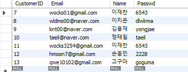

이후에 로그인 시 해당 값을 입력 받으면 `SELECT` 문이 실행된다. 다음 쿼리문과 같다.
```sql
SELECT Email, Passwd
FROM Customer
WHERE Email = '사용자 입력한 이메일' and Passwd = '사용자 입력한 비밀번호';
```
여기서 큰 결함이 발생했다. `Email` 필드 같은경우에는 중복 생성이 안 되도록 해야 하는데, 내가 테이블 설계할 당시엔 `UNIQUE KEY` 지정을 따로 안해준 것이다. 바로 수정을 해줬다.
```sql
ALTER TABLE `iotservice`.`customer` 
ADD UNIQUE INDEX `Email_UNIQUE` (`Email` ASC) VISIBLE;
;
```

이런식으로 수정 해줬다.

### 화단 추가 화면


화단 추가시에는 `FlowerBed` 테이블에서 사용자가 입력한 값에 따라 `INSERT` 문이 실행 된다.

```sql
INSERT INTO flowerbed(FlowerBedID,cust_id,FlowerBedName)
values(1000,7,'화단')
```
정상적으로 입력이 됐는지 확인한다. 이 외에도 데이터를 더 추가 해줬다.

```sql
select * from flowerbed order by cust_ID
```
**결과**


### 화분 추가 화면


사용자 입력 시 DBMS에서 전달받아 `INSERT`문으로 데이터를 저장한다. 쿼리문은 다음과 같다.

```sql
-- 식물 등록
-- 식물 종류 : 0 = Flower, 1 = Crop, 2= Tree
insert into flowerpot(FlowerPotID, bed_ID, FlowerName, FlowerRegDate, Plant_Type)
values(2002,1000,'튤립','2002-01-04',0)
```
**결과**

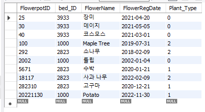

### 화단 재배설정 화면

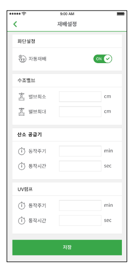

다음은  화단 재배설정 화면에서 필요한 쿼리문이다. 이 역시 사용자로부터 값을 전달받고 `INSERT`문이 작동이 되어야만 한다. 일단, 설정값 입력시 화단 재배설정 고유ID가 자동적으로 삽입 되도록 `AUTO_INCREMENT` 기능을 추가했다.

```sql
ALTER TABLE `iotservice`.`flowerbed_plantsetting` 
CHANGE COLUMN `BedSettingID` `BedSettingID` INT NOT NULL AUTO_INCREMENT ;
```
그 후 값을 삽입했다.

```sql
INSERT INTO flowerbed_plantsetting(Bed_ID_fk,AutoPlant, Valve_MIN,Valve_MAX, AirCycle_Min,
									AirCycle_Sec,UVRampCycle_Min,UVRampCycle_Sec)
VALUES(1000,0,40,80,30,60,15,30)
```
**결과**

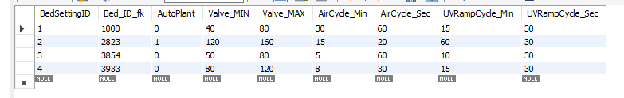

### 화분 재배설정 화면

화분 재배설정화면에서는 `INSERT`문만 실행 돼야한다. 여기서도 설정 고유번호가 기본키로 있으며 사용자로부터 입력을 따로 받지않아도 자동적으로 설정(`auto_increment`) 되도록 했다.

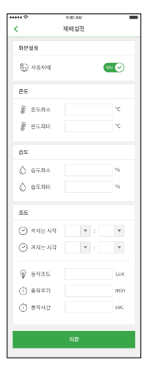

사용자로부터 입력 받을 시 다음과 같은 SQL 문이 실행된다.

```sql
insert into flowerpot_plantsetting(pot_ID,AutoPlant, Temperature_MIN, Temperature_MAX,
								Humidity_MIN, Humidity_MAX, IlluminationTIME_ON, IlluminationTIME_OFF,
                                Lux_Value, Cycle_Min, Cycle_Sec)
values(25,0,15,30,40,60,'09:00:00','19:00:00',20000,30,30)
```
**결과**


정상적으로 삽입된 것을 확인할 수 있다.

### 화단 및 화분 제어 화면

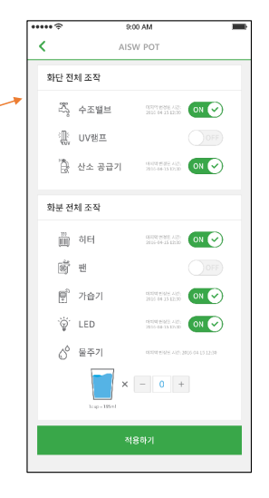

이 화면에서는 화단 및 화분의 모든 기능이 제어가 되야한다. 여기서 사용자의 입력에 따라 값이 저장(초기에는 `INSERT` 문)이 되며, 이 후로는 `UPDATE`문이 실행 되어야 한다. 먼저 화단 제어 정보 테이블부터 설명하겠다.

```sql
ALTER TABLE `iotservice`.`flowerbed_controlinfo` 
CHANGE COLUMN `BedControlSetID` `BedControlSetID` INT NOT NULL AUTO_INCREMENT COMMENT '화단 제어 ID' ;
```
제어 정보에도 고유ID가 필요하다고 판단해, 초기에 사용자로부터 제어정보 전달 받을 시 `AUTO_INCREMENT`로 인해 고유번호가 자동적으로 생성된다. 

```sql
insert into flowerbed_controlinfo(flowerbed_BedID_fk,Valve_Info,UV_Ramp_Info,AirSupply_Info)
values(1000, 0, 1, 0)
-- 1000: 고유 번호, 0 = OFF , 1 = ON
```
이 후 초기에 `INSERT` 문이 실행이 되고 화단(`flowerbed_BedID_fk`)의 고유 번호에 따라 화단이 전체적으로 조작 됐는지 확인할 수 있다. 그리고 값이 변경 될 때 마다 사용자에게 마지막으로 변경 된 시간을 실시간으로 반영돼 보여주기 위해 `CURRENT_TIMESTAMP` 이 `DATE`의 컬럼들에 적용 해주었다.

```sql
ALTER TABLE `iotservice`.`flowerbed_controlinfo` 
CHANGE COLUMN `Valve_ControlDATE` `Valve_ControlDATE` TIMESTAMP NOT NULL DEFAULT CURRENT_TIMESTAMP COMMENT '밸브설정날짜' ,
CHANGE COLUMN `UVRamp_ControlDATE` `UVRamp_ControlDATE` TIMESTAMP NOT NULL DEFAULT CURRENT_TIMESTAMP COMMENT 'UV램프설정날짜' ,
CHANGE COLUMN `AirSupply_ControlDATE` `AirSupply_ControlDATE` TIMESTAMP NOT NULL DEFAULT CURRENT_TIMESTAMP COMMENT '산소공급기설정날짜' ;
```

**결과**

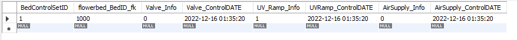

여기서 `UPDATE`문을 실행 해보겠다.

일단 테이블 컬럼들을 수정해줬다. 이유는 기존에 디폴트 값이 `CURRENT_TIMESTAMP` 인 경우에는 초기 값 삽입시에만 적용이 되고 `UPDATE` 문 실행시에는 날짜가 새로 반영이 안된 것이다.
다음과 같이 수정을 해줬다. `CURRENT_TIMESTAMP ON UPDATE CURRENT_TIMESTAMP` 로 설정 해줬다.

```
ALTER TABLE `iotservice`.`flowerbed_controlinfo` 
CHANGE COLUMN `Valve_ControlDATE` `Valve_ControlDATE` TIMESTAMP NOT NULL DEFAULT CURRENT_TIMESTAMP ON UPDATE CURRENT_TIMESTAMP COMMENT '밸브설정날짜' ,
CHANGE COLUMN `UVRamp_ControlDATE` `UVRamp_ControlDATE` TIMESTAMP NOT NULL DEFAULT CURRENT_TIMESTAMP ON UPDATE CURRENT_TIMESTAMP COMMENT 'UV램프설정날짜' ,
CHANGE COLUMN `AirSupply_ControlDATE` `AirSupply_ControlDATE` TIMESTAMP NOT NULL DEFAULT CURRENT_TIMESTAMP ON UPDATE CURRENT_TIMESTAMP COMMENT '산소공급기설정날짜' ;

```
`UPDATE` 쿼리문을 작성해봤다.

```sql
update 	flowerbed_controlinfo
set 	Valve_Info = 1,
		Valve_ControlDATE = default,
		UV_Ramp_Info = 0,
        UVRamp_ControlDATE = default,
        AirSupply_Info = 1,
        AirSupply_ControlDATE = default
where BedControlSetID = 1 and flowerbed_BedID_fk = 1000;
```
정상적으로 반영 되었는지 확인 해보겠다.

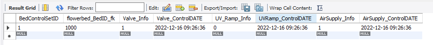

반영 된 것을 확인할 수 있다.

다음은 화분 제어 정보 테이블이다.

```sql
ALTER TABLE `iotservice`.`flowerpot_controlinfo` 
CHANGE COLUMN `WaterSupply_ControlDATE` `WaterSupply_ControlDATE` TIMESTAMP NOT NULL DEFAULT CURRENT_TIMESTAMP COMMENT '물공급설정날짜' ,
CHANGE COLUMN `Heater_ControlDATE` `Heater_ControlDATE` TIMESTAMP NOT NULL DEFAULT CURRENT_TIMESTAMP COMMENT '히터설정날짜' ,
CHANGE COLUMN `Humidifier_ContorlDATE` `Humidifier_ContorlDATE` TIMESTAMP NOT NULL DEFAULT CURRENT_TIMESTAMP COMMENT '가습기설정날짜' ,
CHANGE COLUMN `LED_ControlDATE` `LED_ControlDATE` TIMESTAMP NOT NULL DEFAULT CURRENT_TIMESTAMP COMMENT 'LED설정날짜' ,
CHANGE COLUMN `Fan_ControlDATE` `Fan_ControlDATE` TIMESTAMP NOT NULL DEFAULT CURRENT_TIMESTAMP COMMENT '팬설정날짜' ;
```
화분 제어또한, 값이 변경(`UPDATE`) 될 때 마다 `DATE` 컬럼들이 자동적으로 변경되어 사용자에게 변경 된 시간을 바로 반영할 수 있도록 `CURRENT_TIMESTAMP` 를 기본값으로 사용해줬다.

```sql
ALTER TABLE `iotservice`.`flowerpot_controlinfo` 
CHANGE COLUMN `PotControlSetID` `PotControlSetID` INT NOT NULL AUTO_INCREMENT COMMENT '화분제어고유ID' ;
```
화단 제어정보 테이블처럼 초기 데이터 삽입시 고유번호가 자동적으로 생성되도록 `AUTO_INCREMENT`를 사용했다.

이 부분에서도 `TIMESTAMP` 타입이 `INSERT` 문 실행시에만 값이 실시간으로 바뀐 것을 확인하여 `UPDATE` 부분이 반영되는 것이 중요하기 때문에 디폴트 값을 ` CURRENT_TIMESTAMP ON UPDATE CURRENT_TIMESTAMP ` 로 변경해줬다.

```sql
ALTER TABLE `iotservice`.`flowerpot_controlinfo` 
CHANGE COLUMN `WaterSupply_ControlDATE` `WaterSupply_ControlDATE` TIMESTAMP NOT NULL DEFAULT  CURRENT_TIMESTAMP ON UPDATE CURRENT_TIMESTAMP COMMENT '물공급설정날짜' ,
CHANGE COLUMN `Heater_ControlDATE` `Heater_ControlDATE` TIMESTAMP NOT NULL DEFAULT  CURRENT_TIMESTAMP ON UPDATE CURRENT_TIMESTAMP COMMENT '히터설정날짜' ,
CHANGE COLUMN `Humidifier_ContorlDATE` `Humidifier_ContorlDATE` TIMESTAMP NOT NULL DEFAULT  CURRENT_TIMESTAMP ON UPDATE CURRENT_TIMESTAMP COMMENT '가습기설정날짜' ,
CHANGE COLUMN `LED_ControlDATE` `LED_ControlDATE` TIMESTAMP NOT NULL DEFAULT  CURRENT_TIMESTAMP ON UPDATE CURRENT_TIMESTAMP COMMENT 'LED설정날짜' ,
CHANGE COLUMN `Fan_ControlDATE` `Fan_ControlDATE` TIMESTAMP NOT NULL DEFAULT  CURRENT_TIMESTAMP ON UPDATE CURRENT_TIMESTAMP COMMENT '팬설정날짜' ;

```

초기에 사용자로부터 입력 받을 시 `INSERT`문이 실행된다.

```sql
insert into flowerpot_controlinfo(potID_fk, WaterSupply_Info, 
								Heater_Info, Humidifier_Info, LED_Info, Fan_Info)
values(25, 3, 0, 1, 0)
```

**결과**

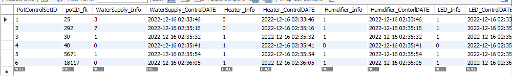

이후 기존에 있는 값으로부터 사용자로에게 입력받을 시 `UPDATE`가 실행 된다.

```sql
/* 물 공급량을 7 -> 1로, 가습기를 0(OFF)으로, 
 * 팬을 1(ON)로 설정했다.
 * 화분 코드는 292, 고유번호는 2다. */ 
update flowerpot_controlinfo
set 
    WaterSupply_Info = 1,
    WaterSupply_ControlDATE = default,
    Humidifier_Info = 0,
    Humidifier_ControlDATE = default,
    Fan_Info = 1,
    Fan_ControlDATE = default
where PotControlSetID = 2 and potID_fk = 292;
```

**결과**

```sql
select * from flowerpot_controlinfo
where potcontrolsetID = 2;
```

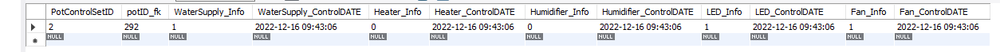

여기서 문제가 발생했다. 내가 원했던 것은, 물 공급, 가습기, 팬의 설정만 바뀌어서 날짜가 자동적으로 바뀌도록 했는데 무슨 이유인지 LED의 날짜 또한 자동적으로 바뀐 것이다. 해결해보겠다.

일단 on update current_timestamp가 문제인듯 하니 이것을 다시 `current_timestamp`로 바꿔주고 사용자로부터 입력 받을 때마다 특정 컬럼만 추출하여 `SQL` 문을 작동하도록 예시를 들어 작성 해봤다.

```sql
ALTER TABLE `iotservice`.`flowerpot_controlinfo` 
CHANGE COLUMN `WaterSupply_ControlDATE` `WaterSupply_ControlDATE` TIMESTAMP NOT NULL DEFAULT CURRENT_TIMESTAMP COMMENT '물공급설정날짜' ,
CHANGE COLUMN `Heater_ControlDATE` `Heater_ControlDATE` TIMESTAMP NOT NULL DEFAULT CURRENT_TIMESTAMP COMMENT '히터설정날짜' ,
CHANGE COLUMN `Humidifier_ControlDATE` `Humidifier_ControlDATE` TIMESTAMP NOT NULL DEFAULT CURRENT_TIMESTAMP COMMENT '가습기설정날짜' ,
CHANGE COLUMN `LED_ControlDATE` `LED_ControlDATE` TIMESTAMP NOT NULL DEFAULT CURRENT_TIMESTAMP COMMENT 'LED설정날짜' ,
CHANGE COLUMN `Fan_ControlDATE` `Fan_ControlDATE` TIMESTAMP NOT NULL DEFAULT CURRENT_TIMESTAMP COMMENT '팬설정날짜' ;
```
그 후 다시 `UPDATE`를 해봤다.

```sql
/*  업데이트 할 화분코드 : 25
 *  업데이트 한 정보 : 물 공급량 3 -> 4 , 가습기 ON -> OFF
 *  나머지는 그대로 */
update flowerpot_controlinfo
set 
    WaterSupply_Info = 4,
    WaterSupply_ControlDATE = default,
    Humidifier_Info = 0,
    Humidifier_ControlDATE = default
where PotControlSetID = 1 and potID_fk = 25;
```
화분코드가 25인 정보를 업데이트 해주겠다. 일단 물 공급량과 가습기만 업데이트 해줬다.
아래는 기존 값이다.

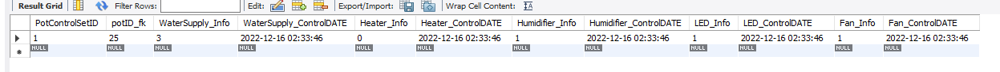

**재 설정 후 결과**

```sql
select * from flowerpot_controlinfo
where PotControlSetID = 1;
```


의도한대로 특정 컬럼을 바꾼 날짜만 정상적으로 변경됐다! 그렇다면, 화분 제어정보 뿐만아니라 화단 제어정보도 현재 `ON UPDATE`로 설정되어 있을 것이다. 해당 테이블 또한 변경이 필요했다.

```sql
ALTER TABLE `iotservice`.`flowerbed_controlinfo` 
CHANGE COLUMN `Valve_ControlDATE` `Valve_ControlDATE` TIMESTAMP NOT NULL DEFAULT CURRENT_TIMESTAMP COMMENT '밸브설정날짜' ,
CHANGE COLUMN `UVRamp_ControlDATE` `UVRamp_ControlDATE` TIMESTAMP NOT NULL DEFAULT CURRENT_TIMESTAMP COMMENT 'UV램프설정날짜' ,
CHANGE COLUMN `AirSupply_ControlDATE` `AirSupply_ControlDATE` TIMESTAMP NOT NULL DEFAULT CURRENT_TIMESTAMP COMMENT '산소공급기설정날짜' ;
```
정상적으로 변경이 됐다.

## 설계 검증

몇 가지 설계검증을 해보려고 한다. 각 테이블에 데이터를 추가 삽입 후 쿼리문 문제를 예로 들어 검증 해보겠다.

1. **유저의 고유번호가 8인 유저가 갖고있는 화단 이름을 확인**하세요.

`SELECT` 문을 사용했다.

```sql
select 	flowerbedName as '화단 이름'
from 	customer cs , flowerbed fb
where 	cs.CustomerID = fb.cust_id AND cs.CustomerID = 8;
```

**결과**


2. 유저고유 번호가 12인 유저의 화단을 새로 등록해야 합니다. 화단의 이름은 월클단이며 고유번호는 4000으로 등록하세요.

```sql
INSERT INTO flowerbed(FlowerBedID,cust_id,FlowerBedName)
values(4000,12,'월클단')
```
**결과**


3. 화단 고유코드가 3933인 화단의 이름과, UV램프와 산소공급기의 시간 주기를 검색 하세요.

```sql
select 	flowerbedName, AirCycle_Min, AirCycle_Sec, UVRampCycle_Min, UVRampCycle_Sec
from 	flowerbed bd, flowerbed_plantsetting fp
where 	bd.FlowerBedID = fp.Bed_ID_fk and bd.FlowerBedID = 3933;
```

**결과**


4. 화단 고유코드가 2823, 화분 고유코드가 5671인 화분의 제어 정보를 업데이트 하세요. 업데이트 항목은 물 공급량을 5로, 히터와 LED를 꺼야합니다. 

먼저 해당 항목이 있는지 검색을 해야한다.

```sql
select 	FlowerBedID, FlowerBedName, FlowerpotID, FlowerName
from 	  flowerbed bd, flowerpot pot, flowerpot_controlinfo info
where 	bd.FlowerBedID = pot.bed_ID AND pot.FlowerpotID = info.potID_fk AND
		    bd.FlowerBedID = 2823 AND pot.FlowerpotID = 5671		
```

**결과**


왜 내가 해바라기 화단에 수박을 넣었는 진 모르겠지만 값이 존재하다는 것을 확인할 수 있다. 이제 해당 데이터를 업데이트 해준다.

```sql
update	flowerpot_controlinfo
set		flowerpot_controlinfo.WaterSupply_Info = 5,
		flowerpot_controlinfo.Heater_Info = 0,
        flowerpot_controlinfo.Heater_ControlDATE = default,
        flowerpot_controlinfo.LED_Info = 0,
        flowerpot_controlinfo.LED_ControlDATE = default
where 	potID_fk = 5671
```

**결과**


정상적으로 작동이 됐다.

## 고찰

처음으로 DB 텀 프로젝트를 진행해봤다. 설계 과정에서 생각보다 난이도가 낮다고 판단했지만 매우 큰 착오였다. 설계 단계에서 제일 문제라고 생각했던 부분이

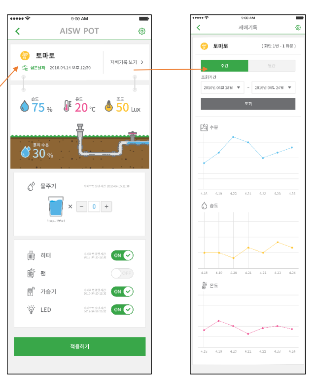

이 모니터링 부분이였는데 이 쪽을 어떻게 해야 DB에서 뽑아서 디스플레이 할 수 있는지 한참 고민을 했다. 내 생각으로 내린 결론으로는 일단 제어 정보 테이블에서 모든 정보를 뽑아와서 화면에 날짜 별로 조회할 수 있는게 아닌가 싶었다. 또한 내가 해당 앱을 설계하면서 큰 실수를 한 것이, 각 테이블에 모두 기본키를 할당하다 보니 제어 정보 및 재배 설정 테이블에서도 굳이 필요하지 않은 기본 키를 생성해서 넣어준 것이다. 사실 제어 및 재배 정보 테이블은 각 해당하는 화단과 화분의 기본키를 외래키로 받아서 이 외래키를 다시 기본키로 지정해주는 것이 더 효율적으로 관리할 수 있지 않았나라는 생각이 든다. 

또한 테이블을 최종 설계 후 생성하고 데이터를 넣는 과정에서 수정하는 것이 매우 번거롭다는 것을 알게됐다. 나 같은 경우엔 `DATE` 타입과 외래키 지정하는 부분에서 안일하게 대처하여 추후 외래키가 잘못 연결 되있고, `Auto_Increment` 부분을 나중에 기본 키에 추가하는 번거로움이 있었다. 이 과정에서 기본 키가 다른 테이블에서 외래키로도 잡혀 있었기에 하나의 테이블의 컬럼을 수정하기 위해 다른 테이블까지 다 건드려야 하는 상황이 온 것이다. 매우 혼란 스러웠다. 따라서 DB의 처음 설계과정이 얼마나 중요하고 신중하게 해야 하는 것인지 알게 됐다.

또한 기존에 `Oracle` 을 이용해서 테이블을 설계하려고 했는데 E-RD 다이어그램을 작성하는 소프트웨어를 찾던 도중 `MySQL` 이란 소프트웨어를 알게되어 해당 프로그램으로 설계 하게 됐는데 매우 중요한 사실을 알게 됐다. 일단 오라클과 `MySQL`의 SQL 문법의 큰 틀은 다르지 않으나 세부적인 예약어 및 데이터타입의 선언등 자잘 자잘한 부분이 많이 다르다는 것을 알게 됐다.  