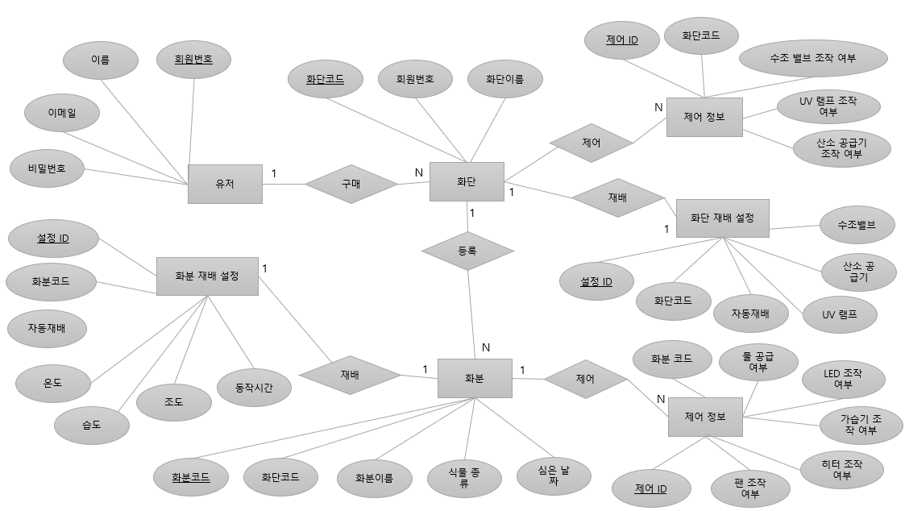
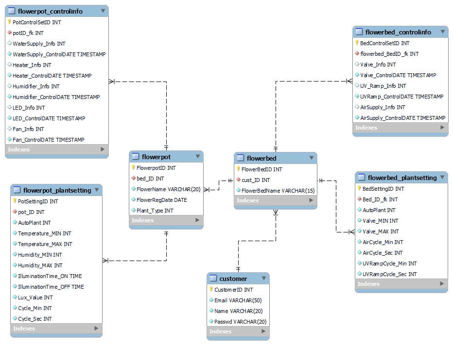
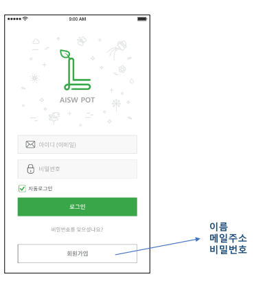
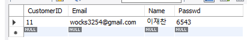
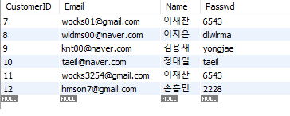
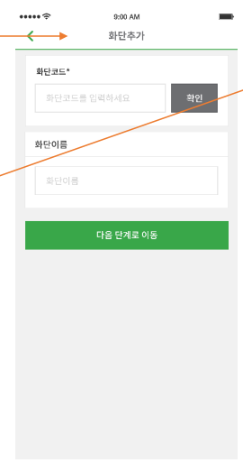
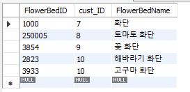
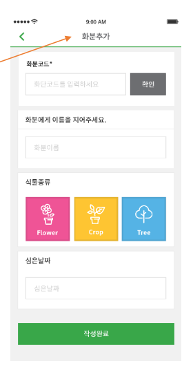

# 데이터베이스 프로젝트 시작 (22/11/28)


## 11/28

+ 주어진 스토리보드에 맞는 데이터 베이스 설계
+ 설계된 데이터베이스 대하여 보고서 작성
   + 보고서 내 필요한 내용
      + 학번 이름 필수
      + 서비스 분석
      + ER 다이어그램
      + IE 표기법
      + 설계 테이블, 프로시저, 함수, 트리거 설명
      + 각 화면에서 사용될 SQL 문
      + 설계 검증
      + 고찰

### 서비스할 제품의 구성


> IoT 실내공장관리 App
실내 공장 관리 서비스로써 사용자들이 모바일을 통해 제어 및 관리 할 수 있다.

+ 고객은 여러 대의 IoT 디바이스를 구매하여 관리할 수 있다.
+ 제품은 화단과 화분으로 구성되며 화단은 여러 개의 화분을 포함한다.
+ 화단은 수조, 산소공급기, UV램프를 관리한다.
+ 화분은 온도, 습도와, 수분량을 모니터링하며, 히터, 팬, 가습기, 조명, 물공급을 제어한다.

### 서비스(요구사항) 분석

1. IoT 앱을 사용하려면 고객의 회원가입이 필요하다.
가입을 위해서는 **고객의 이름, 이메일 주소, 비밀번호**가 필요함.
2. **고객은 여러 대의 IoT 디바이스 제품을 구매하여 관리** 할 수 있다. 제품에는 **화단과 화분**으로 구성되있다.
3. **화단은 여러 개의 화분**을 포함한다.
   + 화단은 **수조, 산소공급기, UV램프를 관리**한다.
   + 화단 추가 시 화단코드와 화단 이름이 필요하다.
   + 화단 재배 설정에 필요한 기능이다.
      + 자동재배 기능(On , Off)
      + 수조밸브 최소,최대 길이 설정 기능
      + 산소 공급기의 동작주기, 시간 설정 기능
      + UV 램프의 동작주기, 시간 설정 기능
4. 화분은 **히터, 팬, 가습기, 조명, 물공급을 제어**한다.
   + 화분의 조회기간을 검색하여 해당 날짜의 온도, 습도와 수분량의 조회 기능이 필요하다.
   + 화분 추가 시 화분 코드, 화분 이름, 식물 종류, 심은 날짜가 필요하다.
   + 화분 재배 설정에 필요한 기능이다.
      + 자동재배 기능(On, Off)
      + 화분의 최소,최대 온도 설정 기능
      + 습도의 최소,최대 온도 설정 기능
      + 조도의 켜지는 시각,꺼지는 시각 설정 기능
      + 조도의 동작조도, 동작주기, 동작시간 설정 기능


## 12/06

### E-R 다이어그램 작성

스토리보드를 토대로 E-R 다이어그램을 작성했다.



### IE 표기법



## 12/15 

### 설계 DB 설명

+ #### `Customer` 테이블
1. 유저 `Table` 에는 **회원번호(Pk)**, **이름, 이메일, 비밀번호** 컬럼이 존재한다. 여기서 중요한 것은, **이메일의 필드는 중복이 허용되지 않아야한다.**
  + 설계한 컬럼 명 및 데이터 타입
    + `CustomerID(PK)` : **INT**
    + `Email` : **VARCHAR(50)**
    + `Name` : **VARCHAR(20)**
    + `Passwd` : **VARCHAR(20)**
+ #### `FlowerBed` 테이블
1. 화단 `Table` 에는 **화단코드(Pk)**, **회원번호(Fk)**, 화단이름 컬럼이 존재하며 유저 테이블과 1 : N 관계를 갖고 있다.
+ 설계한 컬럼 명 및 데이터 타입
    + `FlowerBedID(PK)` : **INT**
    + `cust_ID(FK)` : **INT**
    + `FloewrBedName` : **VARCHAR(15)**
2. 즉 **1명의 유저가 여러개의 화단을 구매할 수 있다는 것**이다.

+ #### `FlowerBed_ControlInfo` 테이블
1. 화단 제어 정보 `Table`에는 **제어 ID(Pk)** ,**화단코드(Fk)**, 수조 밸브 조작 여부와 조작 날짜, UV 램프 조작 여부와 조작 날짜, 산소 공급기 조작 여부와 조작 날짜 컬럼이 존재한다. 조작 날짜 컬럼의 존재 이유는 유저에게 마지막으로 조작(업데이트)한 날짜를 알려주기 위함이다.
+ 설계한 컬럼 명 및 데이터 타입
    + `BedControlSetID(PK)` : **INT**
    + `Flowerbed_BedID_fk(FK)` : **INT**
    + `Valve_Info` : **INT(1)**
    + `Valve_ControlDATE` : **DATETIME** (값 설정 시 년,원,일,시,분,초 까지 들어가도록 설정하기 위해서다.)
    + `UV_Ramp_Info` : **INT(1)**
    + `UVRamp_ControlDATE` : **DATETIME**
    + `AirSupply_Info` : **INT(1)**
    + `AirSupply_ControlDATE` : **DATETIME**
2. **화단 제어 정보 테이블은 화단 테이블과 1 : N 관계를 갖고 있다. 1개의 화단은 화단 제어 정보 여러 개를 가질 수 있는 것**이다.

+ #### `FlowerBed_PlantSetting` 테이블

1. 화단 재배 설정 `Table`에는 **설정 ID(Pk)**, **화단 코드(Fk)**, 자동 재배 여부(Boolean), UV램프의 동작주기와 시간, 산소공급기의 동작주기와 시간, 수조 밸브의 최소 최대 길이 컬럼이 존재한다.
+ 설계한 컬럼 명 및 데이터 타입
    + `BedSettingID(PK)` : **INT**
    + `Bed_ID_fk(FK)` : **INT**
    + `AutoPlant` : **INT(1)** (값 설정 시 ON,OFF 여부를 DB에 저장하기 위해 0,1 값으로만 들어가도록 설정했다.)
    + `Valve_MIN` : **INT**
    + `Valve_MAX` : **INT**
    + `AirCycle_MIN` : **INT**
    + `AirCycle_MAX` : **INT**
    + `UVRampCycle_MIN` : **INT**
    + `UVRampCycle_MAX` : **INT**
2. 화단 재배 설정 테이블은 화단 테이블과 1 : 1 관계를 갖고 있다. **화단 한 개마다 화단 제어 재배 설정 정보는 하나만 존재**할 수 있다.

+ #### `FlowerPot` 테이블
1. 화분 `Table` 에는 **화분코드(Pk)**, **화단 코드(Fk)**, 화분 이름, 식물 종류, 심은 날짜 컬럼이 존재한다. 화분 테이블은 화단 테이블과 N : 1 관계이다.
+ 설계한 컬럼 명 및 데이터 타입
    + `FlowerPotID(PK)` : **INT**
    + `bed_ID(FK)` : **INT**
    + `FloewrName` : **VARCHAR(20)**
    + `FlowerRegDate` : **DATE**
    + `Plant_Type` : **INT(3)** (식물 종류는 총 3가지 이므로 사용자로부터 입력시 DB에서는 0,1,2 로 인식하도록 했다.)
2. **화단 하나에 여러 개의 화분이 존재할 수 있다. 반대로 화분 하나는 여러 대의 화단을 가질 수 없다.**

+ #### `FlowerPot_ControlInfo` 테이블
1. 화분 제어 정보 `Table`에는 **제어 ID(Pk)**, **화분 코드(Fk)**, 물 공급 여부, LED 조작 여부, 가습기 조작 여부, 히터 조작 여부, 팬 조작 여부 (전부 Boolean) 컬럼이 존재한다.
+ 설계한 컬럼 명 및 데이터 타입
    + `PotControlSetID(PK)` : **INT**
    + `potID_fk(FK)` : **INT**
    + `WaterSupply_Info` : **INT(1)**
    + `WaterSupply_ControlDATE` : **DATETIME**
    + `Heater_Info` : **INT(1)**
    + `Heater_ControlDATE` : **DATETIME**
    + `Humidifier_Info` : **INT(1)**
    + `Humidifier_ControlDATE` : **DATETIME**
    + `LED_Info` : **INT(1)**
    + `LED_ControlDATE` : **DATETIME**
    + `Fan_Info` : **INT(1)**
    + `Fan_ControlDATE` : **DATETIME**
2. 이 역시 화단 테이블과 1 : N 관계를 갖고 있다. 화단 하나에 제어 정보 여러개를 가질 수 있다.

+ #### `FlowerPot_PlantSetting` 테이블
1. 화분 제배 정보 `Table`에는 **설정 ID(Pk)**, **화분 코드(Fk)**, 자동 재배 여부(Boolean), 최소 최대 온도, 최소 최대 습도, 조도의 켜지는 시각과 꺼지는 시각, 동작 조도, 동작 주기와 시간 컬럼이 존재한다.
+ 설계한 컬럼 명 및 데이터 타입
    + `PotSettingID(PK)` : **INT**
    + `pot_ID(FK)` : **INT**
    + `AutoPlant` : **INT(1)**
    + `Temperature_MIN` : **INT**
    + `Temperature_MAX` : **INT**
    + `Humidity_MIN` : **INT**
    + `Humidity_MAX` : **INT**
    + `IlluminationTime_ON` : **DATE** (조도의 ON,OFF 설정 시간은, 시,분 단위기 때문에 DATE 데이터타입으로 지정했다.)
    + `IlluminationTime_OFF` : **DATE**
    + `Lux_Value` : **INT**
    + `Cycle_Min` : **INT**
    + `Cycle_Sec` : **INT**
    + `Plant_DATE` : **DATE**
2. **화단 재배 설정 테이블과 화단 테이블은 1 : 1 관계를 가질 수 있으며 화단 하나에 재배 설정이 하나만 존재**할 수 있다.

### 테이블 생성 SQL 문

상기의 내용으로 테이블을 생성하는 SQL 문이다.

```sql
-- -----------------------------------------------------
-- Table `iotservice`.`customer`
-- -----------------------------------------------------
CREATE TABLE IF NOT EXISTS `iotservice`.`customer` (
  `CustomerID` INT NOT NULL AUTO_INCREMENT,
  `Email` VARCHAR(50) NOT NULL COMMENT '고객메일',
  `Name` VARCHAR(20) NOT NULL COMMENT '고객성명',
  `Passwd` VARCHAR(20) NOT NULL COMMENT '패스워드',
  PRIMARY KEY (`CustomerID`),
  UNIQUE INDEX `CustomerID_UNIQUE` (`CustomerID` ASC) VISIBLE,
  UNIQUE INDEX `Email_UNIQUE` (`Email` ASC) VISIBLE)
ENGINE = InnoDB
AUTO_INCREMENT = 2
DEFAULT CHARACTER SET = utf8mb3;


-- -----------------------------------------------------
-- Table `iotservice`.`flowerbed`
-- -----------------------------------------------------
CREATE TABLE IF NOT EXISTS `iotservice`.`flowerbed` (
  `FlowerBedID` INT NOT NULL,
  `CustomerID` INT NOT NULL,
  `FlowerBedName` VARCHAR(15) NOT NULL COMMENT '화단이름',
  PRIMARY KEY (`FlowerBedID`),
  INDEX `fk_flowerbed_customer1_idx` (`CustomerID` ASC) VISIBLE,
  CONSTRAINT `fk_flowerbed_customer1`
    FOREIGN KEY (`CustomerID`)
    REFERENCES `iotservice`.`customer` (`CustomerID`)
    ON DELETE NO ACTION
    ON UPDATE NO ACTION)
ENGINE = InnoDB
DEFAULT CHARACTER SET = utf8mb3;


-- -----------------------------------------------------
-- Table `iotservice`.`flowerbed_controlinfo`
-- -----------------------------------------------------
CREATE TABLE IF NOT EXISTS `iotservice`.`flowerbed_controlinfo` (
  `BedControlSetID` INT NOT NULL AUTO_INCREMENT COMMENT '화단 제어 ID',
  `FlowerBedID` INT NOT NULL,
  `Valve_Info` INT NULL COMMENT '수조밸브설정',
  `Valve_ControlDATE` TIMESTAMP NOT NULL COMMENT '밸브설정날짜',
  `UV_Ramp_Info` INT NULL COMMENT 'UV램프설정',
  `UVRamp_ControlDATE` TIMESTAMP NOT NULL COMMENT 'UV램프설정날짜',
  `AirSupply_Info` INT NULL COMMENT '산소공급기설정',
  `AirSupply_ControlDATE` TIMESTAMP NOT NULL COMMENT '산소공급기설정날짜',
  PRIMARY KEY (`BedControlSetID`),
  INDEX `fk_flowerbed_controlinfo_flowerbed1_idx` (`FlowerBedID` ASC) VISIBLE,
  CONSTRAINT `fk_flowerbed_controlinfo_flowerbed1`
    FOREIGN KEY (`FlowerBedID`)
    REFERENCES `iotservice`.`flowerbed` (`FlowerBedID`)
    ON DELETE CASCADE
    ON UPDATE CASCADE)
ENGINE = InnoDB
DEFAULT CHARACTER SET = utf8mb3;


-- -----------------------------------------------------
-- Table `iotservice`.`flowerbed_plantsetting`
-- -----------------------------------------------------
CREATE TABLE IF NOT EXISTS `iotservice`.`flowerbed_plantsetting` (
  `PotSettingID` INT NOT NULL AUTO_INCREMENT,
  `FlowerBedID` INT NOT NULL,
  `AutoPlant` INT NOT NULL COMMENT '자동재배여부',
  `Valve_MIN` INT NOT NULL COMMENT '밸브최소길이값',
  `Valve_MAX` INT NOT NULL COMMENT '밸브최대길이값',
  `AirCycle_Min` INT NOT NULL COMMENT '산소공급기동작주기값',
  `AirCycle_Sec` INT NOT NULL COMMENT '산소공급기동작시간값',
  `UVRampCycle_Min` INT NOT NULL COMMENT 'UV램프동작주기값',
  `UVRampCycle_Sec` INT NOT NULL COMMENT 'UV램프동작시간값',
  INDEX `fk_flowerbed_plantsetting_flowerbed1_idx` (`FlowerBedID` ASC) VISIBLE,
  PRIMARY KEY (`PotSettingID`),
  CONSTRAINT `fk_flowerbed_plantsetting_flowerbed1`
    FOREIGN KEY (`FlowerBedID`)
    REFERENCES `iotservice`.`flowerbed` (`FlowerBedID`)
    ON DELETE CASCADE
    ON UPDATE CASCADE)
ENGINE = InnoDB
DEFAULT CHARACTER SET = utf8mb3;


-- -----------------------------------------------------
-- Table `iotservice`.`flowerpot`
-- -----------------------------------------------------
CREATE TABLE IF NOT EXISTS `iotservice`.`flowerpot` (
  `FlowerpotID` INT NOT NULL,
  `FlowerBedID` INT NOT NULL COMMENT '화단고유ID',
  `FlowerName` VARCHAR(20) NOT NULL COMMENT '화분이름',
  `FlowerRegDate` DATE NOT NULL COMMENT '화분등록날짜',
  `Plant_Type` INT NOT NULL COMMENT '화분식물종류',
  `flowerbed_FlowerBedID` INT NOT NULL,
  PRIMARY KEY (`FlowerpotID`),
  INDEX `fk_flowerpot_flowerbed1_idx` (`flowerbed_FlowerBedID` ASC) VISIBLE,
  CONSTRAINT `fk_flowerpot_flowerbed1`
    FOREIGN KEY (`flowerbed_FlowerBedID`)
    REFERENCES `iotservice`.`flowerbed` (`FlowerBedID`)
    ON DELETE NO ACTION
    ON UPDATE NO ACTION)
ENGINE = InnoDB
DEFAULT CHARACTER SET = utf8mb3;


-- -----------------------------------------------------
-- Table `iotservice`.`flowerpot_controlinfo`
-- -----------------------------------------------------
CREATE TABLE IF NOT EXISTS `iotservice`.`flowerpot_controlinfo` (
  `PotControlSetID` INT NOT NULL AUTO_INCREMENT COMMENT '화분제어고유ID',
  `FlowerpotID` INT NOT NULL,
  `FlowerPotID` INT NOT NULL COMMENT '화분고유ID',
  `WaterSupply_Info` INT NULL COMMENT '물공급값',
  `WaterSupply_ControlDATE` TIMESTAMP NOT NULL COMMENT '물공급설정날짜',
  `Heater_Info` INT NULL COMMENT '히터설정',
  `Heater_ControlDATE` TIMESTAMP NOT NULL COMMENT '히터설정날짜',
  `Humidifier_Info` INT NULL COMMENT '가습기설정',
  `Humidifier_ContorlDATE` TIMESTAMP NOT NULL COMMENT '가습기설정날짜',
  `LED_Info` INT NULL COMMENT 'LED설정',
  `LED_ControlDATE` TIMESTAMP NOT NULL COMMENT 'LED설정날짜',
  `Fan_Info` INT NULL COMMENT '팬설정',
  `Fan_ControlDATE` TIMESTAMP NOT NULL COMMENT '팬설정날짜',
  PRIMARY KEY (`PotControlSetID`),
  INDEX `FlowerPotID_idx` (`FlowerPotID` ASC) VISIBLE,
  INDEX `fk_flowerpot_controlinfo_flowerpot1_idx` (`FlowerpotID` ASC) VISIBLE,
  CONSTRAINT `fk_flowerpot_controlinfo_flowerpot1`
    FOREIGN KEY (`FlowerpotID`)
    REFERENCES `iotservice`.`flowerpot` (`FlowerpotID`)
    ON DELETE CASCADE
    ON UPDATE CASCADE)
ENGINE = InnoDB
DEFAULT CHARACTER SET = utf8mb3;


-- -----------------------------------------------------
-- Table `iotservice`.`flowerpot_plantsetting`
-- -----------------------------------------------------
CREATE TABLE IF NOT EXISTS `iotservice`.`flowerpot_plantsetting` (
  `PotSettingID` INT NOT NULL AUTO_INCREMENT COMMENT '화분설정고유ID',
  `FlowerpotID` INT NOT NULL,
  `AutoPlant` INT NOT NULL COMMENT '자동재배여부',
  `Temperature_MIN` INT NOT NULL COMMENT '최소온도',
  `Temperature_MAX` INT NOT NULL COMMENT '최대온도',
  `Humidity_MIN` INT NOT NULL COMMENT '최소습도',
  `Humidity_MAX` INT NOT NULL COMMENT '최대습도',
  `IlluminationTime_ON` DATE NOT NULL COMMENT '조도켜진시각',
  `IlluminationTime_OFF` DATE NOT NULL COMMENT '조도꺼진시각',
  `Lux_Value` INT NOT NULL COMMENT '조도값\\n',
  `Cycle_Min` INT NOT NULL COMMENT '동작주기값',
  `Cycle_Sec` INT NOT NULL COMMENT '동작시간값',
  `Plant_DATE` TIMESTAMP NOT NULL DEFAULT CURRENT_TIMESTAMP COMMENT '심은날짜',
  PRIMARY KEY (`PotSettingID`),
  INDEX `fk_flowerpot_plantsetting_flowerpot1_idx` (`FlowerpotID` ASC) VISIBLE,
  CONSTRAINT `fk_flowerpot_plantsetting_flowerpot1`
    FOREIGN KEY (`FlowerpotID`)
    REFERENCES `iotservice`.`flowerpot` (`FlowerpotID`)
    ON DELETE CASCADE
    ON UPDATE CASCADE)
ENGINE = InnoDB
DEFAULT CHARACTER SET = utf8mb3;
```
### 프로시저

유저가 회원가입할 시에 사용할 프로시저이다.

```sql
CREATE DEFINER=`root`@`localhost` PROCEDURE `INSERT_Cust`(
	userMail varchar(50),
    userName varchar(20),
    userPwd  varchar(20)
)
BEGIN
	INSERT INTO Customer(Email,Name,Passwd)
    values(userMail, userName, userPwd);
END
```

```sql

## 각 화면에서 사용될 SQL 문

모바일 앱의 각 화면에서 사용할 SQL문들을 정의하겠다.

### 로그인 화면



맨 처음의 로그인 화면이다. 이 화면에서 사용자가 입력할 경우 **`SELECT`**문이 작동한다. 일단 회원가입 먼저 해보겠다. 회원가입 시에는 **`INSERT`** 문이 실행이 돼야한다. 여기서 나는 회원 생성 시 회원고유번호(`CustomerID`)를 입력하지 않아도, 자동적으로 생성 되도록 `auto_increment` 시퀀스를 사용했다.

```SQL
-- auto_increment를 통해 아이디 생성 시 CustomerID 자동으로 값 추가.
ALTER TABLE Customer 
MODIFY CustomerID INT NOT NULL auto_increment;
```
그 후 사용자로부터 입력을 받으면 해당 SQL문이 DBMS에 실행된다고 가정한다.

```sql
INSERT  INTO customer(Email, Name, Passwd)
VALUES('wocks3254@gmail.com','이재찬','6543');
```
잘 입력 됐는지 확인이 필요하다.
```sql
SELECT *
FROM Customer
where email = 'wocks3254@gmail.com';
```
**결과**



정상적으로 입력이 됐다.
이 외에도 여러 값들을 넣어줬다.



이후에 로그인 시 해당 값을 입력 받으면 `SELECT` 문이 실행된다. 다음 쿼리문과 같다.
```sql
SELECT Email, Passwd
FROM Customer
WHERE Email = '사용자 입력한 이메일' and Passwd = '사용자 입력한 비밀번호';
```
여기서 큰 결함이 발생했다. `Email` 필드 같은경우에는 중복 생성이 안되도록 해야하는데, 내가 테이블 설계할 당시엔 `UNIQUE KEY` 지정을 따로 안해준 것이다. 바로 수정을 해줬다.
```sql
ALTER TABLE `iotservice`.`customer` 
ADD UNIQUE INDEX `Email_UNIQUE` (`Email` ASC) VISIBLE;
;
```

이런식으로 수정해줬다.

### 화단 추가 화면



화단 추가시에는 `FlowerBed` 테이블에서 사용자가 입력한 값에 따라 `INSERT` 문이 실행된다.

```sql
INSERT INTO flowerbed(FlowerBedID,cust_id,FlowerBedName)
values(1000,7,'화단')
```
정상적으로 입력이 됐는지 확인한다. 이 외에도 데이터를 더 추가해줬다.

```sql
select * from flowerbed order by cust_ID
```
**결과**



### 화분 추가 화면


