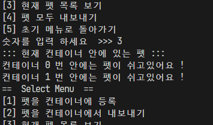

## 펫 컨테이너 관리 프로그램

### 목적 

> 컨테이너에서 강아지와 고양이를 관리하는 프로그램을 제작한다.
프로그램 제작 후 컨테이너에서 강아지와 고양이를 관리 가능한 예를 보여야한다.

### 코드

#### `Container.java`

코드 내 메소드 : 5 개(`CurrentPetInfo` , `RegistPet` , `LeavePet` , `ShowPetList` , `AllLeavePet`)

슈퍼 클래스 : `Container`

서브 클래스 : `Dog` , `Cat`

```java
package Container;
import java.util.ArrayList;

public class Container {
    ArrayList<Container> con = new ArrayList<Container>(10); // Container 객체 생성 시 10개 인덱스 생성
    String registPetName;
    String masterName;
    String petType;

    public Container() {} // 기본 생성자

    /* 서브 클래스 업 캐스팅 시 사용할 생성자 */
    public Container(String registPetName, String masterName, String petType) {
        this.registPetName = registPetName;
        this.masterName = masterName;
        this.petType = petType;
    }

    // Pet 정보 출력 메소드
    void CurrentPetInfo(String mName, String pName, String pType) {
        this.masterName = mName;
        this.registPetName = pName;
        this.petType = pType;
        System.out.println("주인 이름 : " + masterName);
        System.out.println("펫 이름 : " + registPetName);
        System.out.println("펫 종류 : " + petType);
    }

    // Pet 등록 메소드
    int RegistPet(String mName, String pName, int type) {
        if(type == 1) {
            /* 메인 메소드에서 입력 값 1일 시, Dog 서브 클래스 업캐스팅 후 객체 생성.
            *               입력 값 2일 시, Cat 서브 클래스 업캐스팅 후 객체 생성.
            */
            String petType = "강아지";
            con.add(new Dog(mName, pName, petType));
            System.out.println("\"" + petType + "\" 등록 완료 !");  
            CurrentPetInfo(mName, pName, petType);
        }
        else if (type == 2) {
            String petType = "고양이";
            con.add(new Cat(mName, pName, petType));
            System.out.println("\"" + petType + "\" 등록 완료 !");  
            CurrentPetInfo(mName, pName, petType);
        }
        // 1 , 2를 제외한 입력 값 받을 시 오류 텍스트 출력
        else {
            System.out.println("입력 값 오류 ! 숫자 \"1\" 또는 \"2\"로 다시 입력해주세요.");
        }

        return 0;
    }

    int LeavePet(String mName, String pName) {
        if(con.isEmpty()){ // 모든 방이 비어 있을 경우
            System.out.println("현재 모든 방이 비어있습니다.");
        }
        else {
            for(int i = 0; i < con.size(); i++){
                Container c = con.get(i);
                if(mName.contains(c.masterName) && pName.contains(c.registPetName)) {
                    System.out.println("== 내보내는 펫 정보 == ");
                    CurrentPetInfo(mName, registPetName, petType);
                    System.out.println("\n펫이 있던 컨테이너 번호 : ( " + i + " ) 번 방");
                    System.out.println("펫 \""+ registPetName +"\" 의 주인인, \"" + mName + "\"님 잘 가세요! \n");
                    con.remove(i);
                }
                else { // 컨테이너 인덱스 요소안에 있는 값이 입력값과 일치하지 않을 경우 텍스트 출력
                    System.out.println("입력하신 주인 이름인 " + mName +  "  이 컨테이너에 없어요.");
                    System.out.println("입력하신 펫 이름인 " + pName +  "  가 가진 정보가 없네요.");
                }
            }
        }
    
        return 0;
    }

    // 모든 컨테이너 인덱스에 있는 객체 요소 지우는 메소드
    void AllLeavePet() {
        if(con.isEmpty()) { // 컨테이너 인덱스에 요소가 없을 경우
            System.out.println("현재 컨테이너에 펫이 없어요 !\n");
        }

        else { // 있을 경우 요소 크기 출력 후 전부 clear
            System.out.println("현재 컨테이너의 펫의 마리 수 : " + con.size());
            System.out.println("모든 펫들을 내보냅니다. ");
            con.clear();
            System.out.println("내보낸 후 컨테이너의 펫의 마리 수 : " + con.size());
        }
    }

    void ShowPetList() { // 각 인덱스에 펫 객체가 있는지 출력해주는 메소드
        System.out.println("::: 현재 컨테이너 안에 있는 펫 :::");
            if(con.isEmpty()) {
                System.out.println("현재 컨테이너에 펫이 없어요 !\n");
            }
            else {
                for(int i = 0 ; i < con.size(); i++) {
                    System.out.println("컨테이너 " + i + " 번 안에는 펫이 쉬고있어요 ! "); 
                }
            }
    }
}


class Dog extends Container {
    public Dog(String registPetName, String masterName, String petType) {
        super(registPetName, masterName, petType);
        CurrentPetInfo(registPetName, masterName, petType);
    }
}

class Cat extends Container {
    public Cat(String registPetName, String masterName, String petType) {
        super(registPetName, masterName, petType);
        CurrentPetInfo(registPetName, masterName, petType);
    }
}
```
`ArrayList`를 이용하여 컨테이너 객체 생성 시 용량 10의 `ArrayList`를 자동적으로 만든다.
생성자가 총 두개 있는데,

```java
    public Container() {} // 기본 생성자

    /* 서브 클래스 업 캐스팅 시 사용할 생성자 */
    public Container(String registPetName, String masterName, String petType) {
        this.registPetName = registPetName;
        this.masterName = masterName;
        this.petType = petType;
    }
```
두 번째 생성자는 메인 메소드 내에서 입력값을 받아 고양이 또는 강아지 서브 클래스를 업캐스팅을 하기 위해 만든 생성자이다.

기능 5개 중 나머지 기능은 정상적으로 구현이 됐지만 `LeavePet` 메소드 기능 구현에서 부딪힌 점이 있다.

```java
for(int i = 0; i < con.size(); i++){
                Container c = con.get(i);
                if(mName.contains(c.masterName) && pName.contains(c.registPetName)) {
                    ...
```

컨테이너 객체의 모든 사이즈만큼 검색 후 사용자의 입력 값과 일치한지 확인해야하는데

```java
else { // 컨테이너 인덱스 요소안에 있는 값이 입력값과 일치하지 않을 경우 텍스트 출력
                    System.out.println("입력하신 주인 이름인 " + mName +  "  이 컨테이너에 없어요.");
                    System.out.println("입력하신 펫 이름인 " + pName +  "  가 가진 정보가 없네요.");
                }
```

`ArrayList` 같은 경우엔 0번째 인덱스의 정보를 가져오는 건 별다른 문제가 없지만
for문으로 계속 값을 찾으면 0번째의 원하는 정보가 없을 경우 `else` 의 출력문구가 계속 실행되는 것이 문제였다.

.PNG)

이런식으로 말이다. 해결방안이 마땅히 떠오르지 않는다.

#### `UI.java`

메인 메소드 내 코드 길이 단축 프로그램 실행 시 및 가독성을 위해 만든 `UI` 클래스이다.

```java
package Container;

public class UI {

    void Menu() {
        System.out.println("== Pet Container ==");
        System.out.println("[1] 입장");
        System.out.println("[2] 종료");
        System.out.print("숫자를 입력 하세요  >>> ");
    }

    void SelectMenu() {
        System.out.println("==  Select Menu  ==");
        System.out.println("[1] 펫을 컨테이너에 등록");
        System.out.println("[2] 펫을 컨테이너에서 내보내기");
        System.out.println("[3] 현재 펫 목록 보기");
        System.out.println("[4] 펫 모두 내보내기");
        System.out.println("[5] 초기 메뉴로 돌아가기");
        System.out.print("숫자를 입력 하세요  >>> ");
    }
}
```

#### `Program.java`

메인 메소드이다.

```java
package Container;

import java.util.InputMismatchException;
import java.util.Scanner;

public class Program {
    public static void main(String args[]) {
        /* 메인 메소드 내 지역변수 선언 */
        Container con = new Container(); 
        Scanner sc = new Scanner(System.in);
        UI menu = new UI();
        int menuSelNum = 0;
        try { // try-catch 문으로 숫자를 제외한 문자열 입력 시 InputMismatchException 예외처리
            while (true) 
            {
                menu.Menu();
                menuSelNum = sc.nextInt();
                sc.nextLine();
                if (menuSelNum == 1) 
                {
                    int mainNum = 0;
                    while (mainNum != 5) 
                    {
                        int petType;
                        String petName;
                        String masterName;
                        menu.SelectMenu();
                        mainNum = sc.nextInt();
                        sc.nextLine();
                        switch (mainNum) 
                        {
                            case 1: // 펫 등록
                                System.out.println("펫을 등록합니다.");
                                System.out.print("주인 이름을 입력하세요 : ");
                                masterName = sc.nextLine();
                                System.out.print("펫 이름을 입력하세요 : ");
                                petName = sc.nextLine();
                                System.out.print("펫 종류 입력 [1] 강아지 [2] 고양이 : ");
                                petType = sc.nextInt();
                                sc.nextLine();
                                con.RegistPet(masterName, petName, petType);
                                break;
                            case 2: // 펫 내보내기
                                System.out.println("펫을 컨테이너에서 꺼내줍니다.");
                                System.out.print("등록하셨던 주인 이름을 입력하세요 : ");
                                masterName = sc.nextLine();
                                System.out.print("펫의 이름을 입력하세요 : ");
                                petName = sc.nextLine();
                                con.LeavePet(masterName, petName);
                                break;
                            case 3: // 펫 리스트 출력
                                con.ShowPetList();
                                break;                                
                            case 4: // 펫 전부 내보내기
                                con.AllLeavePet();
                                break;
                            case 5: // 초기 메뉴로 복귀
                                System.out.println("초기 메뉴로 돌아갑니다.");
                                break;
                            default:
                                System.out.println("입력 값 오류 ! 숫자 [1-5]만 입력하세요.\n");

                                break;
                        }
                    }
                } else if (menuSelNum == 2) {
                    System.out.println("프로그램을 종료합니다.");
                    sc.close();
                    break;
                } else { // 1-2번을 제외한 모든 숫자 입력 값 받을 시 오류 처리
                    System.out.println("입력 값 오류. 다시 입력하세요.\n");
                }
            }
        } catch (InputMismatchException e) {
            // 숫자 외 입력 값 받을 시 프로그램 종료
            System.out.println("숫자만 입력해주세요. 프로그램을 종료합니다. ");
        }
    }
}
```

### 결과

메인 메소드 실행 시 결과이다.


1번 입력 시 프로그램 실행,
2번 입력 시 프로그램 종료이다. 여기서 숫자를 제외한 문자 입력을 받을 시
```java
catch (InputMismatchException e) {
            // 숫자 외 입력 값 받을 시 프로그램 종료
            System.out.println("숫자만 입력해주세요. 프로그램을 종료합니다. ");
        }
```

`InputMismatchException` 예외처리로 프로그램을 종료시킨다.


1번 입력시 나오는 메뉴이다.

다음은 1번 입력 후 펫을 컨테이너에 등록하는 이미지이다.


고양이를 등록했다.


강아지를 등록했다.
여기서 `LeavePet` 메소드 내에서 문제됬던 상황이 발생한다.

.PNG)

0번 인덱스에서 값을 찾지 못하여 정보가 없다는 출력문이 나오고 사용자 입력값과 1번 인덱스의 값이 일치하여 정상적으로 출력 된것을 확인할 수 있다.


다행히도 0번 인덱스에 있는 객체는 정상적으로 검색이 돼, 출력이 잘 된것을 확인할 수 있다.


입력 값과 인덱스 내에 값이 일치하지 않을 경우의 텍스트이다.

다음은 컨테이너 안에 펫이 2개 들어있는 상태에서 3번을 선택할 시 나오는 이미지이다.



내가 원했던 기능은 인덱스 번호 요소마다 펫의 정보까지 출력하고 싶었다.


4번 입력 시 컨테이너 내에 들어있는 객체들을 전부 초기화시킨다.

### 느낀 점

`ArrayList`를 이용하여 전에 구현해봤던 펫 호텔과 유사하게 만들어봤다.

펫 호텔을 구현했을 때는 클래스 및 객체 생성을 어디서 어떻게 하는지, 각 기능들을 메소드로 

하나 하나 쪼개어 만드는 것이 지금에 비하면 많이 부족했었다. 이번에 `ArrayList`를 활용하여 

메소드의 기능을 최대한 쪼개서 만들었고 추후 수정하는 것을 고려해서 만들어봤다.

배열을 다루는게 쉽진 않지만, `Java`에서 자료구조 요소들을 라이브러리로 존재해서 

자료구조의 중요성 및 이것을 어떻게 다루냐에따라 메모리 효율성이 중요한 지 알았다.

