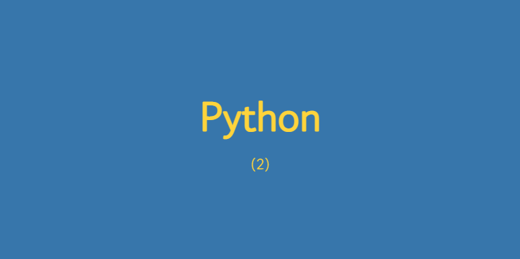

### <a href="https://velog.io/@jaepal/Python-2-%EC%B6%9C%EB%A0%A5-%EB%B3%80%EC%88%98-%EB%8D%B0%EC%9D%B4%ED%84%B0-%ED%83%80%EC%9E%85">원글 ( Velog )</a>



# 개요

이번 게시글에서는 출력문과 변수의 선언 , 데이터 표현 단위를 알아보려고 합니다.
아주 기초적이지만 매우 중요한 기초지식이기 때문에 꼭 이해하고 넘어가야 하는 내용들이라고 생각합니다.

<br>

## 변수 (Variable) 🗃

프로그래밍 언어에서 변수란, **사용자가 원하는 어떠한 값을
저장하기 위한 특정 이름을 가진 공간**입니다.

여기서 **공간은, 정확히 컴퓨터의 메모리 공간**입니다.

보통 변수를 선언한다는 뜻은 사용자가 특정한 값을 저장하기 위한 공간을 준비하는 것을 의미합니다.

파이썬은 다른 프로그래밍 언어와는 달리 변수의 선언이 필수는 아니지만
어떠한 프로그램을 만들기 위해서 변수의 선언을 권장합니다.

아래 코드와 같이 변수를 선언합니다.

```python
number = 0		# 숫자 0을 저장한 변수명 number
number = "0"	# 문자 "0"을 저장한 변수명 number
```

첫 번째 줄 코드는 **숫자 0을 저장한 변수** number 입니다.
두 번째 줄 코드는 **문자 "0" 을 저장한 변수** number 입니다.

이해하기 어려울 수 있습니다.
통상적인 프로그래밍 언어에서의 규칙중 하나를 알아야합니다.
컴퓨터는 문자를 이해하려면 어떠한 문자 또는 숫자 값을 `""` 또는 `''` 로 감싸줘야 이해합니다.

문자를 제외한 숫자를 컴퓨터에게 알려주기 위해선 `""` , `''` 가 아닌
아래와 같이 선언합니다.
```python
hundredNumber = 100
myWeight = 60.5		# 정수가 아닌 소수 값 선언도 가능하다.
myMoney = 550000
```

아래 코드를 봐봅시다.

```python
myName = "Lee Jae Chan"
myLocation = "Korea, Seoul"
myAge = 23
```

`myName` 이라는 변수안에 문자열 `"Lee Jae Chan"` 을 넣었습니다.
`myLocation` 이라는 변수안에 문자열 `"Korea, Seoul"`을 넣었습니다.

그렇다면 myAge에 23을 넣었다면 문자열이 아닌 숫자로 이해하겠죠 ?

### 변수명 규칙

+ **대소문자를 구분합니다.**
	myMoney 와 mymoney는 다른 변수명으로 컴퓨터가 인식합니다.

+ 문자 , 숫자 , 언더바(_) 를 포함할 수 있습니다. 그러나 변수명의 첫 단어를
숫자로 사용하면 안됩니다.
	정상적인 변수명 선언 : `inputNumber` , `text_Files_List` , `Var_List`
    잘못된 변수명 선언 : `0_inputNumber` , `400Won`
    
    
### 변수의 사용법들

변수는 값을 대입하면 사용이 가능합니다.
변수에 있던 기존 값들은 없어지고 새로운 값으로 변경됩니다.

```python
myMoney = 1000
myMoney = 2000
print(myMoney)	# myMoney 변수 화면에 출력
>>> 2000		# 결과

```

변수에는 변수의 값을 넣을수 있고 계산 결과 또한 넣을 수 있습니다.

```python
myMoney = 1000
yourMoney = myMoney
print(yourMoney)	# 변수 yourMoney 출력
>>> 1000			# 결과		
```

또한 변수에는 숫자와 변수의 연산을 넣을 수 있습니다.

```python
myMoney = 1000
yourMoney = myMoney + 500 # myMoney(1000) + 500
print(yourMoney)	# 변수 yourMoney 출력
>>> 1500			# 결과
```

이번엔 변수에 연산 결과를 자신의 값으로 다시 대입하는 방법을 알아봅시다. 헷갈릴수 있습니다.

```python
myMoney = 100
myMoney = myMoney + 200		# myMoney(100) + 200
print(myMoney)		# 변수 myMoney 출력
>>> 300				# 결과
```

파이썬은 다른 언어와 다르게 변수의 데이터 형식이 값에 따라 바뀝니다.

```python
myMoney = 100	# 정수형(int) 변수 생성
type(myMoney)	# <class 'int'>
>>> class int

myMoney = "100" # 문자열형(str) 변수 생성
type(myMoney)	# <class 'str'>
>>> class str

myMoney = 100.0 # 실수형(float) 변수 생성
type(myMoney)	# <class 'float'>
>>> class float
```

**제일 중요합니다.**

변수의 대입 연산자`(=)`의 왼쪽에는 무조건 변수만 올 수 있습니다. 오른쪽에는 어떠한 값이 오든 상관이 없지만 왼쪽에는 변수만 존재할 수 있습니다.

```python
10 = 100
```

이처럼 대입값의 왼쪽에 숫자 10을 사용하는건 잘못된 선언입니다.

```python
변수명 = 100
```

이런 식으로 사용을 해줘야합니다.

<br>

## `print()`

파이썬의 print() 함수는, 특정 데이터의 값을 화면에 출력할 수 있습니다.

```python
print("Hello World !")
>>> Hello World !

print("제 나이는 %d 입니다." % 23)
```

두번 째 코드인 `%d`는 변환 문자입니다.

+ %d : 정수 데이터
+ %f : 실수 데이터
+ %s : 문자열 데이터
+ %c : 문자 데이터

변환 문자를 이용하여 아래와 같이 출력이 가능합니다.

```python
print("제 이름은 %s 입니다." %"이재찬")
>>> 제 이름은 이재찬 입니다.

print("This Year is %d ." %2022)
>>> THis Years is 2022.

print("원의 지름에 대한 원둘레의 비율은 , %f 입니다." %3.14)
>>> 원의 지름에 대한 원둘레의 비율은 3.14 입니다.
```

### 이스케이프 문자


**이스케이프 문자**는, 이스케이프 시퀀스를 따르는 문자들입니다.
간단하게 특수문자들을 화면에 출력하는 문자들입니다.

아래의 표를 통해 쉽게 이해해봅시다.

|이스케이프 문자|역할|기능|
|:-----|:-----|:-----|
|`\n`|새로운 줄로 이동 , 줄 바꿈|`Enter`를 누른 효과|
|`\t`|다음 탭 이동|코드 작성시 `Tab`을 누른 효과|
|`\b`|뒤로 한 칸 이동|`Backspace`를 누른 효과|
|`\\`|텍스트 `\` 출력||
|`\'`|텍스트 `'` 출력||
|`\*`|텍스트 `*` 출력||

이스케이프 문자의 표현방식은 언어들 대부분이 비슷합니다.

<br>

## 데이터 타입


### 비트 & 바이트
컴퓨터에서 표현할 수 있는 제일 작은 단위는 **비트(Bit)** 입니다.

비트는 0과 1만 존재하며 1비트로는 두 가지만 표현이 가능합니다.

1비트가 8개 모이면 **바이트(Byte)** 입니다.

### 2진수

컴퓨터는 수를 표현하거나 이해할 때 두가지 수로 표현하는데 바로 0과 1입니다. 이것이 **2진수**입니다.


### 10진수

우리가 수를 표현할 때 사용하는 것, 즉 0~9로 이루어진 수 
통상적인 셈의 표현을 **10진수**라고 합니다.


### 16진수

16진수는 0-9 의 수와 A - F의 로마숫자를 이용하여 숫자를 셉니다. 사실 컴퓨터를 위한 표현 방식입니다.

제 생각이지만 2진수의 가독성을 위해 개선되어 나온 표현방식이 16진수라고 생각합니다.


2진수 , 16진수의 개념은 이해하기 어려울 수 있습니다.
다음 표를 통해 각 진수의 표현을 간단하게 표현해봤습니다. 

|2진수 ( Binary )|10진수 ( Decimal )|16진수 ( Hex )|
|:-----:|:-----:|:-----:|
|0|0|0|
|1|1|1|
|10|2|2|
|11|3|3|
|100|4|4|
|101|5|5|
|110|6|6|
|111|7|7|
|1000|8|8|
|1001|9|9|
|1010|10|A|
|1011|11|B|
|1100|12|C|
|1101|13|D|
|1110|14|E|
|1111|15|F|

## 데이터 타입 표현

```python
myMoney = 1500
type(myMoney)
>>> <class 'int'>
```

파이썬은 변수에 값을 넣는 순간 변수의 자료형이 알아서 결정 됩니다.

위에서 작성한 진수의 표현을 파이썬에서 작성이 가능합니다.

16진수의 출력입니다.
```python
# 16진수의 표현
hexNum = 0xFF
hexNum2 = 0o77
hexNum3 = 0b1111

print(hexNum, hexNum2, hexNum3)
>>> 255 63 15
```

10진수의 출력입니다.
```python
# 10진수의 표현
myBirthDay = 20000731
circlePi = 3.14

print(myBirthDay, circlePi)
>>> 20000731 3.14
```

2진수는 사람이 직접 타이핑할수 없기 때문에 10진수, 16진수를
변환하여 2진수로 표현해줘야 합니다.

파이썬으로 다음과 같이 표현할 수 있습니다.

```python
TestNumber = 39

binaryNumber = format(TestNumber, 'b')
HexNumber = format(TestNumber, 'x')

print(binaryNumber) # 2 진수
print(TestNumber)	# 10진수
print(HexNumber)	# 16진수

>>> 100111
>>> 39
>>> 27
```
사실 진수의 표현은 2,10,16 진수외에도 8진수도 있습니다.
8진수도 사용하는 경우가 있지만 통상적으로 16진수를 제일 많이 사용하기 때문에 제외했습니다. 

저도 사실 8진수의 표현방식은 정확히 모릅니다.. 😌

<br>

## 마치며

프로그래밍을 본격적으로 시작한다고 한다면 제일 중요하게 생각하는 표현 단위에 대해서 얕게 설명해봤습니다 !
작성을 하면서 저도 처음 파이썬을 배울 때가 생각이 났네요. 👶

다음 작성때는 나머지 숫자 부분과 문자열에 대해서 다뤄볼까 합니다.

<br>

#### 참고 자료

> <a href="https://namu.wiki/w/16%EC%A7%84%EB%B2%95">namu.wiki - 수와 연산</a>
<a href="https://www.google.com/imghp?hl=ko__&gws_rd=ssl">Google Image - 이미지 참고</a>

