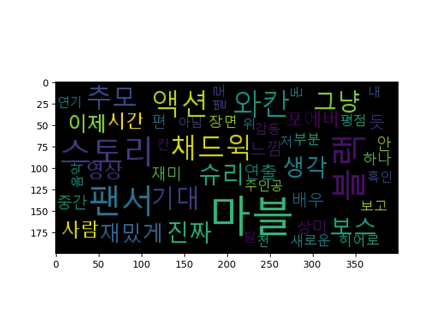

# 영화별 리뷰 분석

`movie_aisw.csv` 파일 이용하여 다음과 같은 사항을 작성한다.

1. 파일 읽어오기(`movie_aisw.csv`)
2. 데이터 탐색(구성과 데이터 타입 확인)
3. 영화 개수 확인
4. 영화별 평점과 리뷰 수 확인
5. '올빼미' 영화에 대한 형태소 분석(불용어 제거)
6. '올빼미' 영화에 대한 `Wordcloud` 생성
7. 영화 리뷰수가 두번 째로 많은 영화의 분석 및 워드클라우드 생성(1-6번 반복)


## 1. 파일 읽어오기

```python
# 필요 라이브러리 로드
import pandas as pd
import numpy as np
import collections
import matplotlib.pyplot as plt
from wordcloud import WordCloud
from konlpy.tag import Okt

# 1. 파일 읽어오기
df = pd.read_csv('Python\DataProject\data\movie_aisw.csv')
```
해당 사항을 작성하기 위한 라이브러리들을 불러온다.
그 후, 주어진 csv 파일을 `pandas`를 이용해 로드한다.

## 2. 데이터 탐색(구성과 데이터 타입 확인)

```python
# 2. 데이터 탐색(구성과 데이터 타입 확인)
print(df.info())
print(df.dtypes)
```
로드한 데이터의 정보들의 구성과 데이터 타입을 확인하기 위해 `info()` 함수와 `dtypes` 를 사용한다.

### 결과

```python
<class 'pandas.core.frame.DataFrame'>
RangeIndex: 4139 entries, 0 to 4138
Data columns (total 3 columns):
 #   Column    Non-Null Count  Dtype
---  ------    --------------  -----
 0   movie     4139 non-null   object
 1   sentence  4139 non-null   object
 2   score     4139 non-null   int64
dtypes: int64(1), object(2)
memory usage: 97.1+ KB
None
movie       object
sentence    object
score        int64
dtype: object
```

## 3. 영화의 개수 확인

```python
# 3. 영화 개수 확인
print(df['movie'].describe())
print(df['movie'].unique()) # 중복 없이 나온 영화 제목 : 총 6개
```

### 결과
```python
count     4139
unique       6
top        올빼미
freq      2994
Name: movie, dtype: object

['올빼미' '동감' '유포자들' '블랙 팬서: 와칸다 포에버' '스트레인지 월드' '데시벨']
```
`movie` 컬럼의 정보를 확인하기 위해 `descrbie()` 함수를 이용해서 정보를 확인했다. 
알 수 있는 정보로는 총 개수(4139개)와 중복 값을 제거한 수(6개), 제일 많이 사용한 데이터(`올빼미`)와 빈도수(2994개)를 알수 있다.

## 4. 영화 별 평점과 리뷰 수 확인

```python
# 4. 영화별 평점과 리뷰 수 확인
# 데이터 프레임의 GroupBy 함수를 이용해 각 행에 영화의 이름별로 그룹화 하여
# 리뷰 및 평점을 영화 별 펑점과 리뷰 총 개수 출력
movieGroupBy = df.groupby('movie')
print(movieGroupBy.count())
```

### 결과
```python                    
    movie                    sentence  score
    데시벨                        340    340
    동감                          217    217
    블랙 팬서: 와칸다 포에버         383    383
    스트레인지 월드                 179    179
    올빼미                        2994   2994
    유포자들                        26     26
```
`Pandas`의 `groupby`를 이용하여 `movie` 컬럼의 중복 데이터들을 그룹화 하여 평점 및 리뷰의 총 개수를 확인했다.

## 5. '올빼미' 영화에 대한 형태소 분석(불용어 제거)

```python
# 5. '올빼미' 영화에 대한 형태소 분석(불용어 제거)
#  원본 데이터프레임에서 'movie' 컬럼의 '올빼미'가 포함된 행만 추출하여 
#  새로운 데이터 프레임인 `df_owl` 생성.
df_owl = df[df['movie'].str.contains('올빼미')].copy()
print(df_owl.count())
```
이제 **올빼미** 영화의 데이터만 추출하여 형태소를 분석 해야한다.
나 같은 경우엔 `contains`를 이용해, 올빼미인 값만 추출하여 `df_owl` 이라는 새로운 데이터 프레임을 생성했다. 그 후 **올빼미** 데이터의 총 개수를 확인했다.

```python
movie       2994
sentence    2994
score       2994
dtype: int64
```
총 2994개의 데이터가 존재한 것을 확인할 수 있다.

그 후 중복 값 및 결측치가 존재한 지 확인을 했다.
```python
# 중복 제거 및 결측치 확인
print(df_owl['movie'].nunique())
print(df_owl.isnull().sum()) # 결측치와 중복값 없는것을 확인
```
**결과**

```python
1
movie       0
sentence    0
score       0
dtype: int64
```
그 다음 작업으로 불용어를 만든 뒤, 형태소 토큰화 작업을 하여 빈도수가 많은 상위 50개의 단어를 생성해줬다.

```python
# 불용어 제거 및 형태소 토큰화
okt = Okt()
stopword = ['점', '정말', '왜', '말', '그', '없다', 
            '정도', '걸', '뭐', '이건','영화', '완전', 
            '좀', '있는', '거', '나','이', '볼', '입니다', 
            '것', '이런', '더', '수', '때']
list = []
for sentence in df_owl['sentence']:
    s_list = okt.pos(sentence)
    for word, tag in s_list:
        if word not in stopword:
            if tag in ['Noun', 'Adjective']:
                list.append((word))

counts = collections.Counter(list)
tag = counts.most_common(50)
# 빈도수가 많은 상위 50개의 단어 출력
print(tag)
```
### 결과

```python
[('연기', 1089), ('배우', 695), ('진짜', 486), ('유해진', 423), ('최고', 387), ('스토리', 377), ('연출', 370), ('류준열', 361), ('몰입', 294), ('재밌게', 222), ('긴장감', 221), ('연기력', 210), ('만', 201), ('시간', 195), ('올해', 191), ('반전', 157), ('역
사', 156), ('꼭', 149), ('생각', 147), ('감', 139), ('보고', 126), ('사극', 125), ('중', 122), ('간만', 117), ('류준', 116), ('장면', 111), ('추천', 108), ('기대', 107), ('왕', 102), ('몰입도', 100), ('재밌어요', 97), ('올빼미', 96), ('소름', 94), ('스릴러', 92), ('대박', 92), ('처음', 87), ('끝', 87), ('안', 83), ('중간', 82) ...
```
## 6. '올빼미' 영화에 대한 WordCloud 생성

```python
# 6. '올빼미' 영화에 대한 WordCloud 생성
font_path = 'C:\Windows\Fonts\malgun.ttf'
wc = WordCloud(font_path=font_path, background_color='black', max_font_size=50)

# 빈도수가 많은 상위 50개의 단어로 워드클라우드 생성
cloud = wc.generate_from_frequencies(dict(tag))
# 화면에 출력
plt.imshow(cloud)
plt.show()
```
마지막으로 **상위 50개의 빈도수가 높은 단어들로 워드클라우드를 생성**했다. 

### 결과



## 7. 영화 리뷰수가 두번째로 많은 영화의 분석 및 워드 클라우드 생성 (1-6번 과정 반복)

```python
# 필요 라이브러리 로드
import pandas as pd
import numpy as np
import collections
import matplotlib.pyplot as plt
from wordcloud import WordCloud
from konlpy.tag import Okt

# 7. 영화 리뷰수가 두번째로 많은 영화의 분석 및
#    워드 클라우드 생성 (1-6번 과정 반복)

# 1. 파일 읽어오기
df = pd.read_csv('Python/MovieProject/data/movie_aisw.csv')

# 2. 데이터 탐색(구성과 데이터 타입 확인)
print(df.info())
print(df.dtypes)

# 3. 영화 개수 확인
print(df['movie'].describe())
print(df['movie'].unique()) # 중복 없이 나온 영화 제목 : 총 6개

# 4. 영화별 평점과 리뷰 수 확인
#    영화 이름별로 그룹화 후, 리뷰 수 내림차순으로 정렬
df_groupby = df.groupby('movie').count()
df_groupby_sort = df_groupby.sort_values(by='sentence', ascending=False)
print(df_groupby_sort)

# 5. '블랙 팬서: 와칸다 포에버' 영화대한 형태소 분석(불용어 제거)
df_2 = df[df['movie'].str.contains\
                     ('블랙 팬서: 와칸다 포에버')].copy()
print(df_2.count())

# 중복 제거 및 결측치 확인
print(df_2['movie'].nunique())
print(df_2.isnull().sum()) # 결측치와 중복값 없음.

# 불용어 제거 및 형태소 토큰화
okt = Okt()

# 불용어의 배열 집합
stopword = ['점', '정말', '왜', '말', '그', '없다', 
            '정도', '걸', '뭐', '이건','영화', '완전', 
            '좀', '있는', '거', '나','이', '볼', '입니다', 
            '것', '이런', '더', '수', '때']
list = []
for sentence in df_2['sentence']:
    s_list = okt.pos(sentence)
    for word, tag in s_list:
        if word not in stopword:
            if tag in ['Noun', 'Adjective']:
                list.append((word))

counts = collections.Counter(list)
tag = counts.most_common(50)
# 빈도수가 많은 상위 50개의 단어 출력
print(tag)

# 6. '블랙 팬서: 와칸다 포에버' 영화에 대한 WordCloud 생성
font_path = 'C:/Windows/Fonts/malgun.ttf'
wc = WordCloud(font_path=font_path, background_color='black', max_font_size=50)

# 빈도수가 많은 상위 50개의 단어로 워드클라우드 생성
cloud = wc.generate_from_frequencies(dict(tag))

# 화면에 출력
plt.imshow(cloud)
plt.show()
```

### 2 번째로 많은 데이터를 찾은 과정

```python
df_groupby = df.groupby('movie').count()
df_groupby_sort = df_groupby.sort_values(by='sentence', ascending=False)
print(df_groupby_sort)
```

1-3 번 과정은 기존 영화 분석 코드와 같지만 4번 과정에서 **리뷰수가 2번 째로 많은 데이터를 확인**하기 위해 `GroupBy`로 데이터들을 묶어준 후 `sort_values`를 이용해 값들을 정렬해줬다.

```python
movie                    sentence  score
올빼미                       2994   2994
블랙 팬서: 와칸다 포에버        383    383 <<
데시벨                       340    340
동감                         217    217
스트레인지 월드               179    179
유포자들                     26     26
```

여기서 **블랙 팬서: 와칸다 포에버** 가 두 번째로 많은 데이터임을 알 수 있었다.
나머지 과정은 기존 코드와 같다.

## 결과


# 환경 데이터 분석

`measuredData.csv` 파일을 이용하여 **환경 데이터를 분석**한다.

1. 파일 읽어오기
2. 기본 정보 및 기초 통계량 확인
3. 한글 컬럼명 영문명으로 변경
4. 데이터 타입 변경
5. 결측치 확인 및 처리
6. 상관계수 함수를 이용하여 요소 별 상관관계 분석
7. 히스토그램으로 시각화
8. 막대그래프로 일별 현황 그래프 출력
9. 히트맵으로 상관관계 시각화
10. 산점도 그래프로 온도화 미세먼지(PM10) 확인
11. 미세먼지(PM10)과 초미세먼지(PM2.5) 관계를 산점도 그래프로 확인
12. 데이터 분석 정리

## 1. 파일 읽어오기

```python
# 라이브러리 로드
import pandas as pd
import numpy as np
import matplotlib.pyplot as plt

# 1. 파일 읽어오기
df = pd.read_csv('Python/DataProject/data/measuredData.csv')
```
환경 데이터 파일 분석을 위한 라이브러리를 불러온 뒤, 데이터파일을 로드해준다.

## 2. 기본 정보 및 기초 통계량 확인

```python
# 2. 기본 정보 및 기초 통계량 확인
print(df.describe())
```
데이터의 정보 및 기초 통계량 확인을 위해 `describe()` 함수를 사용했다.

**결과**

```
        아황산가스    일산화탄소      오존      이산화질소     PM10        PM2.5       기온(°C)
count  738.000000  738.000000  712.000000  738.000000  738.000000  738.000000   744.000000
mean     0.003214    0.388211    0.021588    0.022798   25.589431   12.911924   15.570833
std      0.000486    0.112619    0.015737    0.011497   10.986398    7.633149    5.649605
min      0.002000    0.200000    0.001000    0.004000    3.000000    1.000000    1.300000
25%      0.003000    0.300000    0.008000    0.014000   17.000000    7.000000   11.400000
50%      0.003000    0.400000    0.021000    0.021000   25.000000   13.000000   16.450000
75%      0.003000    0.500000    0.032000    0.029000   34.000000   18.000000   19.525000
max      0.006000    0.900000    0.081000    0.059000   72.000000   51.000000   28.700000
```

각 컬럼별 **데이터의 개수,평균,표준편차, 최소,최대, 4분위 값** 들을 확인할 수 있었다. 

## 3. 한글 컬럼명 영문명으로 변경

위의 데이터들의 이름중이 한글인 컬럼을 영문으로 변경 해야한다.

```python
# 3. 한글 컬럼명 영문명으로 변경
print(df.columns) # 컬럼명 확인
```
먼저 컬럼명들을 확인해서 바꿔야 할 컬럼명들을 확인해준다.

```python
>>> Index(['날짜', '아황산가스', '일산화탄소', '오존', '이산화질소', 'PM10', 'PM2.5', '기온(°C)'], dtype='object')
```
바꿔야 할 컬럼명은 **총 6개**다.

```python
# 한글명 컬럼을 영어로 변경
df.rename(columns={'날짜':'Date','아황산가스':'Sulfurous','일산화탄소':'Carbon',
                   '오존':'Ozone','이산화질소':'Nitrogen','기온(°C)':'Temperture(°C)'},inplace=True)
print(df.columns)
```

+ 날짜 → **Date**
+ 아황산가스 → **Sulfurous**
+ 일산화탄소 → **Carbon**
+ 오존 → **Ozone**
+ 이산화질소 → **Nitrogen**
+ 기온(°C) → **Temperture(°C)**

`rename` 함수를 이용해, 각 컬럼명들을 영문으로 변경해줬다.

**결과**

```python
>>> Index(['Date', 'Sulfurous', 'Carbon', 'Ozone', 'Nitrogen', 'PM10', 'PM2.5',
       'Temperture(°C)'], dtype='object')
```

## 4. 데이터 타입 변경

현재 환경 데이터중에 데이터 타입이 올바른 타입이 없는지 확인을 해줘야한다.

```python
# 4. 데이터 타입 변경
print(df.dtypes) # 데이터 타입 확인
```
먼저 각 컬럼들의 데이터 타입 확인을 위해 `dtypes` 함수를 이용했다.

```python
Date               object
Sulfurous         float64
Carbon            float64
Ozone             float64
Nitrogen          float64
PM10              float64
PM2.5             float64
Temperture(°C)    float64
```

`Date` 컬럼을 제외한 나머지 컬럼은 정상적인 데이터 타입인 것을 확인했다. `Date` 컬럼 같은 경우 `object` 타입이므로, `datetime` 타입으로 변경해줘야 한다.

```python
df['Date'] = pd.to_datetime(df['Date'], 
                            format='%Y-%m-%d %H:%M:%S', 
                            errors='coerce')
print(df['Date'])
```
**결과**

```python
>>>
0     2021-10-01 01:00:00
1     2021-10-01 02:00:00
2     2021-10-01 03:00:00
3     2021-10-01 04:00:00
4     2021-10-01 05:00:00
              ...
739   2021-10-31 20:00:00
740   2021-10-31 21:00:00
741   2021-10-31 22:00:00
742   2021-10-31 23:00:00
743                   NaT
Name: Date, Length: 744, dtype: datetime64[ns]
```
정상적으로 변환이 되었다.

여기서 나는 한 가지 궁금증이 있었다. datetime 같은 경우엔, 2021-10-31 24:00 가 존재할 수 없다는 것이다.
그 이유는 2021-10-30 24:00 와 2021-10-31 00:00 는 같은 시간이다. 이것을 확인한 후 `pd.to_datetime()` 함수의 `errors='coerce'`가 아닌 `raise`를 넣어 오류가 나오는 지 확인했다.


역시나! 에러가 발생했다. 24시는 올바르지 않은 형식이다. 이를 해결하기 위해 

```python
import datetime

def setDateTime(date_str):
    if date_str[10:12] != '24':
        return pd.to_datetime(date_str, format='%Y-%m-%d %H')

    date_str = date_str[0:10] + '00' + date_str[10:]
    return pd.to_datetime(date_str, format='%Y-%m-%d %H') + \
        pd.Timedelta(days=1)
           
df['Date'] = df['Date'].apply(setDateTime)
print(df['Date'])
```

함수를 만들어 시간이 **'24'** 가 아닐 경우  datetime 타입으로 바뀌도록 하였고, 이 외에 값은 24시 이기 때문에, `timeDelta`를 이용하여 시간을 00시로 바꾸고 일수를 증가하도록 시도를 해봤다.


계속 값을 바꿔봐도 문제가 발생했다.

일단 결측치 값이 생각보다 크지 않으니 기존 코드로 진행했다.

## 5. 결측치 확인 및 처리

```python
# 5. 결측치 확인 및 처리
print(df.isnull().sum()) # 결측치 확인
df = df.dropna(how='any') # NaN 값 모두 삭제후 새로운 데이터프레임 생성
print(df.isnull().sum()) # 재출력
```

결측치 확인을 위해 `isnull()` 함수를 사용하고, `dropna`를 이용해 값이 없는 데이터를 삭제한 후 새로운 데이터 프레임을 생성해줬다.

**결과**


결측 값 수

+ Date : 31 
+ Sulfurous(아황산가스) : 6
+ Carbon(일산화탄소) : 6
+ Ozone(오존) : 32
+ Nitrogen(이산화질소) : 6
+ PM10 : 6
+ PM2.5 : 6

## 6. 상관계수 함수를 이용하여 요소 별 상관관계 분석

```python
# 6. 상관계수 함수를 이용하여 요소 별 상관관계 분석
corr_df = df.corr() # 상관계수 데이터 프레임 생성
corr_df = corr_df.apply(lambda x: round(x,2)) # 가독성을 위한 소수점 제거
print(corr_df)
```
각 행(컬럼)끼리의 상관관계를 분석하기 위해 `corr()` 함수를 사용했다.
그 후, 가독성을 위해 `lambda` 함수를 사용해줘서 0.0x 이하의 소수점은 제거해줬다.

**결과**

```python
                Sulfurous  Carbon  Ozone  Nitrogen  PM10  PM2.5  Temperture(°C)
Sulfurous            1.00    0.41   0.23      0.26  0.49   0.48            0.06
Carbon               0.41    1.00  -0.33      0.79  0.56   0.66           -0.17
Ozone                0.23   -0.33   1.00     -0.56  0.18   0.10            0.44
Nitrogen             0.26    0.79  -0.56      1.00  0.37   0.50           -0.30
PM10                 0.49    0.56   0.18      0.37  1.00   0.91           -0.03
PM2.5                0.48    0.66   0.10      0.50  0.91   1.00           -0.03
Temperture(°C)       0.06   -0.17   0.44     -0.30 -0.03  -0.03            1.00
```
결과를 통해 상관관계를 요소 별 상관관계가 분석이 가능하다.

여기서 어느 값에 근접하냐에 따라 상관관계를 파악할 수 있다.

>+ **-1에 가까운 값일 경우**
>매우 강력한 음의 상관이다. **너무 가까울 경우에 데이터의 조작 의심**이 들 수 있다.
>
>+ **-0.5의 값에 가까운 값일 경우**
>강력한 음의 상관이다. **분석가가 X가 증가할 경우 Y가 감소한다고 말 할수 있는 정도**다.

>+ **-0.2의 값에 가까울 경우**
>음의 상관이긴하나, 너무 약하기 때문에 상관관계가 없다곤 할 수 없다.
>
>+ **0에 근접한 값일 경우**
>대부분의 경우가 **상관관계가 있다고 간주하지 않는다**. 2차 방정식 그래프와 비슷한 모양일 경우엔 상관관계가 있다곤 >할 수 있으나 회의적인 경우가 대부분이라고 한다.
>
>+ **0.2의 값에 가까울 경우**
>너무 약한 양의 상관이다. 이 값일 경우 **상관관계가 있다고 장담할 순 없으나, 사회과학에서는 큰 상관관계**가 있다고 >간주한다고 한다.
>
>+ **0.5의 값에 가까운 값일 경우**
>강력한 양의 상관이다. **X가 증가하면 Y또한 증가한다는 주장이 통계적으로 지지**받고 있다고 한다.
>
>+ **1에 가까운 값일 경우**
>매우 강력한 양의 상관이다. 음의 상관과 마찬가지로 이런 상관관계는 쉽게 나타나지 않는다.

### 아황산가스의 상관관계

+ **일산화탄소**와의 상관관계에서 0.41의 값을 보여주고 있으며 이 경우에는 양의 관계라 볼수있다. **대기중 아황산가스 수치가 높으면 일산화탄소 또한 높다고 볼 수 있다.**

+ **오존**과의 상관관계에서 0.2의 값을 보여주고 있으며 이 경우 약한 양의 상관관계다. **대기중에 아황산가스 수치가 >높다고 해서 오존이 무조건 높다고 볼 수 없다.** 

+ **이산화질소**와의 상관관계에서 0.26의 값을 보여주고 있으며 이 또한 오존과 같이 약한 양의 상관관계다.

+ **PM10(미세먼지)** 과의 상관관계에서 0.49의 강력한 양의 상관관계를 보여주고 있다. 이 값으로 보아**아황산가스가 대기중에 많으면 미세먼지 또한 많다**고 볼 수 있다.

+ **PM2.5(초미세먼지)** 과의 상관관계에서 0.48의 강력한 양의 상관관계를 보여준다. 이 또한 **아황산가스의 수치가 높으면 초미세먼지 또한 높다**고 볼 수 있다.

+ **온도(Temperture(°C))** 와의 상관관계에서는 0.06의 값을 보여준다. 이 경우 상관관계가 없다고 볼 수있다. 즉 **아황산가스의 수치의 양이 많거나 적더라도 온도에 영향을 안 받는다**고 볼 수 있다.

### 일산화탄소의 상관관계

+ **오존**과의 관계에서 -0.33의 값을 보여줬으며 이는 음의 상관관계이다. 0.33의 값이라 아예 상관관계가 강력하다고 볼 순 없으나 **일산화탄소 수치가 높으면 오존의 수치는 낮아졌다고 말할 수 있다.**


### 오존의 상관관계

### 이산화질소의 상관관계

### PM10의 상관관계

### PM2.5의 상관관계

### 기온(°C)의 상관관계
