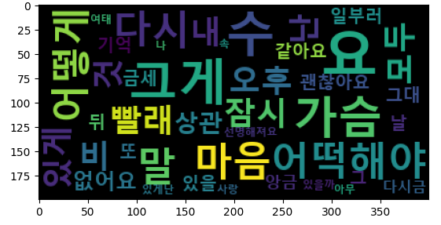
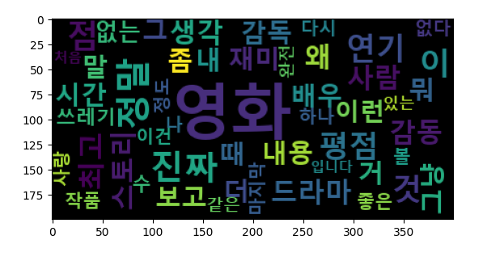
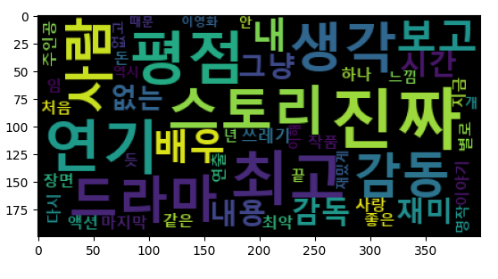

# WordCloud

+ 자연어 전처리에 대한 학습
+ 자연어 전처리를 통한 워드 클라우드 생성

## 라이브러리 설치

형태소 단위로 토큰화 하기 위한 `KoNLPy` , 클라우드 생성을 위해 `wordcloud` 설치

`pip install konlpy`
`pip install wordcloud`

## 단어 토큰화

토큰의 기준을 단어로 하는 경우

+ 영어의 경우

영어는 띄어쓰기로 토큰화가 가능하다.
`" I like Python` -> ` 'I' 'like' 'Python'`

+ 한국어의 경우

한국어는 띄어쓰기로 토큰화가 불가능하다.
`너는` , `너에게`, `너를`, `너와` , `너의` 의 경우 you 인데
`너`에 조사가 붙어서 모두 다른 언어로 인식한다.

형태소(Morpheme) : 뜻을 가지는 가장 작은 단위의 말
+ 명사,대명사,수사,관형사,부사,감탄사,접사,조사 등

## `Okt`를 이용한 토큰화

| 메소드             | 설명           |
|-----------------|--------------|
| `phrases(text)` | 어구 추출        |
| `morphs(text)`  | 형태소 추출       |
| `nouns(text)`   | 명사 추출        |
| `pos(text)`      | 품사정보 추가하여 추출 |

### 형태소 추출

```python
from konlpy.tag import Okt

okt = Okt()
token = okt.morphs('폐허가 된다 해도')
print(token)
```
**결과**
```python
>>> ['폐허', '가', '된다', '해도']
```

### 품사 정보 추가
```python
from konlpy.tag import Okt

okt = Okt()
sentence_tag = okt.pos('폐허가 된다 할지라도')
print(sentence_tag)

sentence_tag = okt.pos('폐허가 된다 할지라도', join=True)
print(sentence_tag)
```
**결과**
```python
>>> [('폐허', 'Noun'), ('가', 'Josa'), ('된다', 'Verb'), ('할지라도', 'Verb')]

>>> ['폐허/Noun', '가/Josa', '된다/Verb', '할지라도/Verb']
```

### 어구 추출
```python
from konlpy.tag import Okt

okt = Okt()
sentence = okt.phrases('인공지능 전처리는 재밌다')
print(sentence)
```
**결과**
```python
>>> ['인공지능', '인공지능 전처리', '인공', '지능', '전처리']
```

### 토큰화 실습(형태소 분석)

```python
from konlpy.tag import Okt

okt = Okt()
verse = '빨래를 해야겠어요 오후엔 비가 올까요 그래도 상관은 없어요 괜찮아요 ' \
        '뭐라도 해야만 할 것 같아요 그러면 나을까 싶어요' \
        '잠시라도 모두 잊을 수 있을 지 몰라요 ' \
        '그게 참 마음처럼 쉽지가 않아서 그게 참 말처럼 되지가 않아서 ' \
        '무너진 가슴이 다시 일어설 수 있게 ' \
        '난 어떡해야 할까요 어떻게 해야만 할까요 ' \
        '그대가 날 떠난 건지 내가 그댈 떠난 건지 ' \
        '일부러 기억을 흔들어 뒤섞어도' \
        '금세 또 앙금이 가라앉듯 다시금 선명해져요' \
        '잠시라도 모두 잊을 수 있을까 했는데' \
        '그게 참 마음처럼 쉽지가 않아서' \
        '그게 참 말처럼 되지가 않아서 ' \
        '무너진 가슴이 다시 일어설 수 있게 ' \
        '난 어떡해야 할까요 어떻게 해야만 할까요 ' \
        '뒤집혀버린 마음이 사랑을 쏟아내도록 ' \
        '그래서 아무 것도 남김 없이 비워내도록 ' \
        '나는 이를 앙 다물고 버텨야 했죠 ' \
        '하지만 여태 내 가슴 속엔' \
        '그게 참 말처럼 쉽게 되지가 않아서' \
        '무너진 가슴이 다시 일어설 수 있게' \
        '난 어떡해야 할까요 어떻게 해야만 할까요' \
        '빨래를 해야겠어요 오후엔 비가 올까요'

sentence_tag = okt.pos(verse)
print(sentence_tag)
```

**결과**
```python
>>> [('빨래', 'Noun'), ('를', 'Josa'), ('해야겠어요', 'Verb'), ('오후', 'Noun'), ('엔', 'Josa'), ...
```

### 동일한 자료가 몇 개인지 빈도수 파악

```python
import collections

adj_list = []
for word, tag in sentence_tag:
    if tag in ['Noun', 'Adjective']:
        adj_list.append(word)

counts = collections.Counter(adj_list)
tag = counts.most_common(10)  # 가사에서 많이 사용된 상위 10개의 단어
print(tag)
```
**결과**
```python
>>> [('요', 7), ('수', 5), ('그게', 5), ('가슴', 4), ('마음', 3), ('말', 3), ('다시', 3), ('어떡해야', 3), ('어떻게', 3), ('빨래', 2)]
```

## WordCloud

```python
# Wordcloud 생성
from konlpy.tag import Okt
from wordcloud import WordCloud
import collections
import matplotlib.pyplot as plt

okt = Okt()
verse = '빨래를 해야겠어요 오후엔 비가 올까요 그래도 상관은 없어요 괜찮아요 ' \
        '뭐라도 해야만 할 것 같아요 그러면 나을까 싶어요' \
        '잠시라도 모두 잊을 수 있을 지 몰라요 ' \
        '그게 참 마음처럼 쉽지가 않아서 그게 참 말처럼 되지가 않아서 ' \
        '무너진 가슴이 다시 일어설 수 있게 ' \
        '난 어떡해야 할까요 어떻게 해야만 할까요 ' \
        '그대가 날 떠난 건지 내가 그댈 떠난 건지 ' \
        '일부러 기억을 흔들어 뒤섞어도' \
        '금세 또 앙금이 가라앉듯 다시금 선명해져요' \
        '잠시라도 모두 잊을 수 있을까 했는데' \
        '그게 참 마음처럼 쉽지가 않아서' \
        '그게 참 말처럼 되지가 않아서 ' \
        '무너진 가슴이 다시 일어설 수 있게 ' \
        '난 어떡해야 할까요 어떻게 해야만 할까요 ' \
        '뒤집혀버린 마음이 사랑을 쏟아내도록 ' \
        '그래서 아무 것도 남김 없이 비워내도록 ' \
        '나는 이를 앙 다물고 버텨야 했죠 ' \
        '하지만 여태 내 가슴 속엔' \
        '그게 참 말처럼 쉽게 되지가 않아서' \
        '무너진 가슴이 다시 일어설 수 있게' \
        '난 어떡해야 할까요 어떻게 해야만 할까요' \
        '빨래를 해야겠어요 오후엔 비가 올까요'

sentence_tag = okt.pos(verse)

adj_list = []
for word, tag in sentence_tag:
    if tag in ['Noun', 'Adjective']:
        adj_list.append(word)

counts = collections.Counter(adj_list)
tag = counts.most_common(50)
print(tag)

font_path = 'C:/Windows/Fonts/malgunbd.ttf'
wc = WordCloud(font_path=font_path, background_color='black', max_font_size=60)
cloud = wc.generate_from_frequencies(dict(tag))

plt.imshow(cloud)
plt.show()
```

**결과**



## 영화리뷰 자연어 처리

```python
# 영화 리뷰 자연어 처리
from konlpy.tag import Okt
import collections
import matplotlib.pyplot as plt
from wordcloud import wordcloud
import pandas as pd
import os

# 파일 사이즈 체크
file_size = os.path.getsize('./data/ratings.txt')
print('File Size : ', file_size, 'bytes')
# File Size :  19515078 bytes
df = pd.read_table('./data/ratings.txt')
```

### 중복제거 & 결측치 확인

```python
# 하나의 아이디로 같은 영화의 리뷰를 여러번 반복 했는지 확인
# Null 값이 있는지 확인
print(df['id'].nunique())
print(df.isnull().sum())

# 결측치 제거
df = df.dropna(how='any')
print(df.isnull().sum())
```

**결과**
```python
>>>
    # 제거 전
    200000
    id          0
    document    8
    label       0
    dtype: int64
    
    # 제거 후
    id          0
    document    0
    label       0
    dtype: int64
```

### 불용어 제거
```python
# 불용어 제거
df['document'] = df['document'].str.replace("[^ㄱ-ㅎㅏ-ㅣ가-힣 ]", "")
print(df)
```

**결과**
```python
>>>
              id                                           document  label
0        8112052                                어릴때보고 지금다시봐도 재밌어요ㅋㅋ      1
1        8132799  디자인을 배우는 학생으로 외국디자이너와 그들이 일군 전통을 통해 발전해가는 문화산업...      1
2        4655635                   폴리스스토리 시리즈는 부터 뉴까지 버릴께 하나도 없음 최고      1
3        9251303   와 연기가 진짜 개쩔구나 지루할거라고 생각했는데 몰입해서 봤다 그래 이런게 진짜 영화지      1
4       10067386                         안개 자욱한 밤하늘에 떠 있는 초승달 같은 영화      1
...          ...                                                ...    ...
199995   8963373                                       포켓 몬스터 짜가 ㅡㅡ      0
199996   3302770                                                쓰레기      0
199997   5458175                    완전 사이코영화 마지막은 더욱더 이 영화의질을 떨어트린다      0
199998   6908648                왜난 재미없었지 ㅠㅠ 라따뚜이 보고나서 스머프 봐서 그런가 ㅋㅋ      0
199999   8548411                                    포풍저그가나가신다영차영차영차      0

[199992 rows x 3 columns]
```

### 형태소 토큰화
```python
okt = Okt()
temp_list = []
for sentence in df['document']:
    s_list = okt.pos(sentence)
    for word, tag in s_list:
        if tag in ['Noun', 'Adjective']:
            temp_list.append(word)

counts = collections.Counter(temp_list)
tag = counts.most_common(50)
print(tag)
```

**결과**
```python
>>> [('영화', 67908), ('정말', 12763), ('진짜', 11270), ('점', 10184), ('이', 10040), ('평점', 8537), 
    ('연기', 8489), ('것', 8430), ('최고', 8049), ('생각', 7140), ('스토리', 7031), ('왜', 6832), 
    ('드라마', 6710), ('감동', 6516), ('사람', 6478), ('보고', 6188), ('말', 6000), ('더', 5865), 
     ('때', 5798), ('배우', 5692), ('내', 5555), ('감독', 5529), ('거', 5426), ('재미', 5238), 
     ('시간', 5171), ('내용', 5163), ('그냥', 5017), ('뭐', 4947), ('그', 4853), ('좀', 4836), 
     ('이런', 4726), ('없는', 4686), ('쓰레기', 4660), ('수', 4299), ('사랑', 4004), ('작품', 3987), 
     ('나', 3876), ('볼', 3822), ('다시', 3771), ('없다', 3768), ('하나', 3766), ('마지막', 3654), 
     ('좋은', 3488), ('이건', 3481), ('정도', 3433), ('같은', 3407), ('완전', 3353), ('있는', 3348), ('입니다', 3320), ('처음', 3266)]
```

### 워드클라우드 시각화

```python
font_path = 'C:/Windows/Fonts/malgunbd.ttf'
wc = WordCloud(font_path=font_path, background_color='black', max_font_size=60)
cloud = wc.generate_from_frequencies(dict(tag))
plt.imshow(cloud)
plt.show()
```

**결과**



### 불용어 제거후 재시각화

```python
stopword = ['점', '정말', '왜', '말', '그', '없다', '정도', '걸', '뭐', '이건',
            '영화', '완전', '좀', '있는', '거', '나', '이', '볼', '입니다'
            , '것', '이런', '더', '수', '때']

list = []
for sentence in df['document']:
    s_list = okt.pos(sentence)
    for word, tag in s_list:
        if word not in stopword:
            if tag in ['Noun', 'Adjective']:
                list.append(word)

counts = collections.Counter(list)
tag = counts.most_common(50)
```

