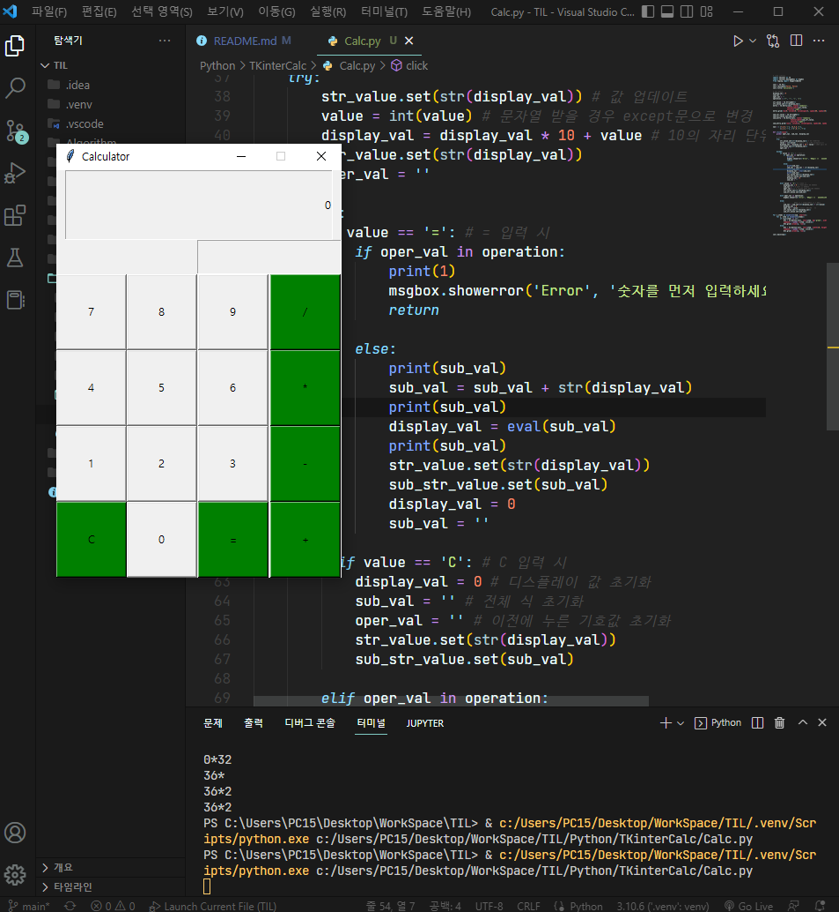
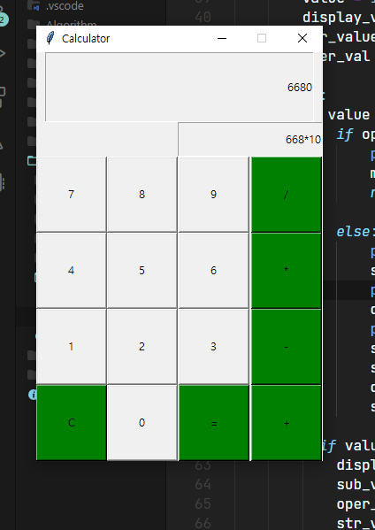

# Python Calculator 

**실행 시 메인 화면**



**계산 시 출력 화면**



실행화면에서 숫자를 제외한 입력값들은 모두 문자열이기 때문에 데이터 타입이 `str`일 경우 백그라운드를 **초록색**으로 지정했다.
```python

# 배열에 저장된 값 계산기에 설정
for i,items in enumerate(num, start=2):
    for j, item in enumerate(items):
        if type(item) is str: # 텍스트 값이 문자열일 경우 백그라운드 "green"
            btn = tk.Button(calc, text=item, bg='green', width=10, height=5,
            command = lambda x=item: click(x))
            btn.grid(column=j, row=i)
        else: # 이외의 숫자 값 전부 기본 백그라운드 색상
            btn = tk.Button(calc, text=item, width=10, height=5,
            command = lambda x=item: click(x))
            btn.grid(column=j, row=i)
```

소스 코드

```python
# Load Library
import tkinter as tk
import tkinter.messagebox as msgbox
from typing import SupportsBytes

calc = tk.Tk()
calc.resizable(False, False)
calc.title('Calculator')

# Set Entry
display_val = 0
sub_val = ''
oper_val = ''
operation = ('+', '-', '/', '*')

str_value = tk.StringVar()
str_value.set(str(display_val))
entry = tk.Entry(calc, state='readonly',
                textvariable=str_value, 
                justify='right')
entry.grid(row=0, column=0, columnspan=4, ipadx=80, ipady=30)

sub_str_value = tk.StringVar()
sub_str_value.set(sub_val)
sub_entry = tk.Entry(calc, state='readonly', 
                    textvariable=sub_str_value,
                    justify='right')
sub_entry.grid(row=1, column=2, columnspan=2, ipadx=10, ipady=10)

num = ( [7,8,9,'/'], [4,5,6,'*'], 
        [1,2,3,'-'], ['C',0,'=','+'])

# 배열에 저장된 값 계산기에 설정
for i,items in enumerate(num, start=2):
    for j, item in enumerate(items):
        if type(item) is str: # 텍스트 값이 문자열일 경우 백그라운드 "green"
            btn = tk.Button(calc, text=item, bg='green', width=10, height=5,
            command = lambda x=item: click(x))
            btn.grid(column=j, row=i)
        else: # 이외의 숫자 값 전부 기본 백그라운드 색상
            btn = tk.Button(calc, text=item, width=10, height=5,
            command = lambda x=item: click(x))
            btn.grid(column=j, row=i)

def click(value):
    global oper_val, sub_val, display_val

    # 예외 처리
    try:
        str_value.set(str(display_val)) # 값 업데이트
        value = int(value) # 문자열 받을 경우 except문으로 변경
        display_val = display_val * 10 + value # 10의 자리 단위로 밀리면서 입력
        str_value.set(str(display_val))
        oper_val = ''

    except:
        if value == '=': # = 입력 시
            if oper_val in operation:
                print(1)
                msgbox.showerror('Error', '숫자를 먼저 입력하세요.')
                return

            else:
                print(sub_val)
                sub_val = sub_val + str(display_val)
                print(sub_val)
                display_val = eval(sub_val)
                print(sub_val)
                str_value.set(str(display_val))
                sub_str_value.set(sub_val)
                display_val = 0
                sub_val = ''

        elif value == 'C': # C 입력 시
            display_val = 0 # 디스플레이 값 초기화
            sub_val = '' # 전체 식 초기화
            oper_val = '' # 이전에 누른 기호값 초기화
            str_value.set(str(display_val))
            sub_str_value.set(sub_val)
        
        elif oper_val in operation:
            msgbox.showerror('Error', '숫자를 먼저 입력하세요.')
        
        else:
            #           기존 식 + 디스플레이 창 + 기호
            sub_val = sub_val+str(display_val) + str(value)
            display_val = 0
            oper_val = value # 입력한 기호값 저장
            str_value.set(str(display_val))
            sub_str_value.set(sub_val)

calc.mainloop()
```