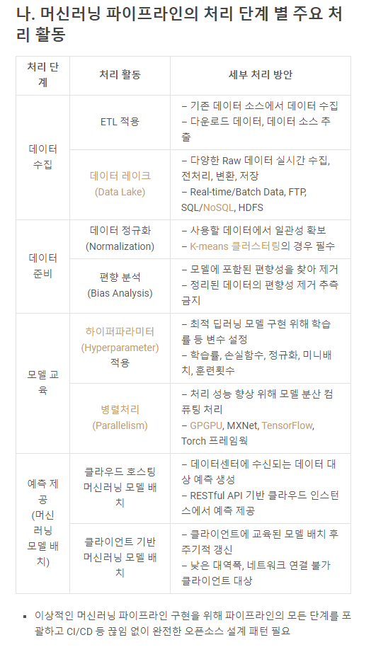

# AI & 딥러닝 정리

## 머신러닝 파이프라인

머신러닝 기술을 활용함에 있어 초기 기획부터 데이터 수집, 가공, 분석과 사후관리까지 일련의 전체 과정이다.

머신러닝 파이프라인은 이런 일련의 과정을 설계하고 관리하는 것을 의미한다.




+ Load data : 데이터 수집 및 적재
+ Data analysis : 데이터 분석
+ Feature Engineering : 데이터의 특성 파악 및 전처리 수행
+ Data validation : 전처리된 데이터를 검증
+ Data Split : 교차 검증을 위한 데이터 분리
+ Build & Train Model : 머신러닝, 딥러닝 모델을 구축하고 훈련을 진행
+ Model Validation : 모델 검증
+ Model Serving : 모델 기록, 보관

## Neural 네트워크의 구성요소

크게 3가지로 분류된다.

### Input Units

Input Layer를 구성할 때 Unit의 갯수는 학습할 dataset의 features의 갯수 가 됩니다.

### Output Units

Output Layer를 구성할 때 Unit의 갯수는 Classification 해야하는 class의 수 와 같습니다.

### Hidden Units

Hidden Layer를 구성할 때 Unit의 갯수는 보통 Input Unit 갯수의 배수 로 정하게 되지만, 공식이나 정답은 정해져있지 않습니다. 다만 하나의 Network안에서 Hidden Layer가 여러개라면 모든 hidden Layer의 unit 갯수는 동일해야 합니다.

하지만 역시 마찬가지로 하나의 Network안에서 Hidden Layer가 몇개여야 하는지 알 수 있는 정답이나 공식은 존재하지 않습니다.

다만 많아지면 많아질 수록 좋은 결과는 보여주겠지만 연산이 복잡해지므로 학습시간이 오래 걸릴 것입니다. 결국 Neural Network를 설계할 때 Layer의 갯수나 Unit의 수를 어떻게 설정한것인지 가 중요한 요소 중 하나가 됩니다.


예를 들어, 입력된 이미지를 보고 자동차, 자전거, 트럭 중 하나로 분류하는 경우를 생각해보겠습니다.

우선 Input data는 이미지의 '픽셀'이 됩니다. 이 경우 2x2 즉 4개의 feature라고 가정해보겠습니다. 따라서 Input Layer의 unit 수는 4개가 됩니다.

Output Layer에선 이미지를 자동차, 자전거, 트럭 즉 3개의 class 중 하나로 예측할 것이므로 Unit의 갯수는 3개가 되어야 합니다.

Hidden Layer는 정해진건 없지만 2개라고 하고, 각 Layer의 Unit 갯수는 Input Unit의 1.5배인 6개라고 설정해볼 수 있습니다.

즉 요약하면

**Input Unit 수** : 학습할 dataset의 Features

**Output Unit 수** : Class 종류의 수

**Hidden Unit 수** : 보통은 Input Unit의 두 배로 정한다.

Hidden Layer가 많아질수록 성능은 좋아지지만 학습 속도가 느려진다.

## 원-핫 인코딩(One-Hot Encoding)

원-핫 인코딩은 단어 집합의 크기를 벡터의 차원으로 하고, 표현하고 싶은 단어의 인덱스에 1의 값을 부여하고, 다른 인덱스에는 0을 부여하는 단어의 벡터 표현 방식입니다. 이렇게 표현된 벡터를 원-핫 벡터(One-Hot vector)라고 합니다.

원-핫 인코딩을 두 가지 과정으로 정리해보겠습니다. 첫째, 정수 인코딩을 수행합니다. 다시 말해 각 단어에 고유한 정수를 부여합니다. 둘째, 표현하고 싶은 단어의 고유한 정수를 인덱스로 간주하고 해당 위치에 1을 부여하고, 다른 단어의 인덱스의 위치에는 0을 부여합니다.

## 다중 분류 손실함수

손실 함수(loss function)는 해당 데이터를 가지고 어떤 형태의 예측을 할 것인지에 따라 선택하면 되는데, 그 중 다중 클래스 분류를 위해 사용되는 손실 함수에 대해 정리해보고자 한다.

일반적으로 다중 클래스 분류 시 **`categorical_crossentropy`** 를 손실 함수로 사용한다. 그런데 **`sparse_categorical_crossentropy`** 또한 다중 클래스 분류 시 손실 함수로 사용할 수 있다. 그렇다면 두 손실함수는 어떤 차이가 있을까?

결론은
훈련 데이터의 label(기대값) 값이 One-Hot 벡터 형태인 경우 `categorical_crossentropy` 를 사용한다.
훈련 데이터의 label값이 정수(Int) 형태인 경우에는 `sparse_categorical_crossentropy`를 사용하면 된다. 정수형태의 경우 `One-hot-encoding`을 하지 않기 때문에 메모리 소요가 적다는 장점이 있다.

## 인공 신경망

### 활성화 함수


앞서 배운 퍼셉트론에서는 계단 함수(Step function)를 통해 출력값이 0이 될지, 1이 될지를 결정했습니다. 이러한 매커니즘은 실제 뇌를 구성하는 신경 세포 뉴런이 전위가 일정치 이상이 되면 시냅스가 서로 화학적으로 연결되는 모습을 모방한 것입니다. 이렇게 은닉층과 출력층의 뉴런에서 출력값을 결정하는 함수를 활성화 함수(Activation function)라고 하는데 계단 함수는 이러한 활성화 함수의 하나의 예제에 불과합니다.

다양한 활성화 함수에 대해서 정리해봅시다. 일부는 머신 러닝 챕터에서 이미 봤던 함수들입니다.

### 계단 함수(Step Function)


계단 함수는 거의 사용되지 않지만 퍼셉트론을 통해 인공 신경망을 처음 배울 때 접하게 되는 활성화 함수입니다.

### 시그모이드 함수(Sigmoid Function)와 기울기 손실


위 인공 신경망의 학습 과정은 다음과 같습니다. 우선 인공 신경망은 입력에 대해서 순전파(forward propagation) 연산을 하고, 그리고 순전파 연산을 통해 나온 예측값과 실제값의 오차를 손실 함수(loss function)을 통해 계산하고, 그리고 이 손실(오차라고도 부릅니다. loss)을 미분을 통해서 기울기(gradient)를 구하고, 이를 통해 출력층에서 입력층 방향으로 가중치와 편향을 업데이트 하는 과정인 역전파(back propagation)를 수행합니다. 역전파에 대해서는 뒤에서 더 자세히 설명하겠지만 일단 여기에서는 인공 신경망에서 출력층에서 입력층 방향으로 가중치와 편향을 업데이트 하는 과정이라고만 언급해두겠습니다. 역전파 과정에서 인공 신경망은 경사 하강법을 사용합니다.

이 시그모이드 함수의 문제점은 미분을 해서 기울기(gradient)를 구할 때 발생합니다.


위 그래프는 시그모이드 함수의 그래프를 보여줍니다. 시그모이드 함수의 출력값이 0 또는 1에 가까워지면, 그래프의 기울기가 완만해지는 모습을 볼 수 있습니다. 

### 하이퍼볼릭탄젠트 함수

하이퍼볼릭탄젠트 함수(tanh)는 입력값을 -1과 1사이의 값으로 변환합니다.


하이퍼볼릭탄젠트 함수도 -1과 1에 가까운 출력값을 출력할 때, 시그모이드 함수와 같은 문제가 발생합니다. 그러나 하이퍼볼릭탄젠트 함수의 경우에는 시그모이드 함수와는 달리 0을 중심으로 하고있으며 하이퍼볼릭탄젠트 함수를 미분했을 때의 최대값은 1로 시그모이드 함수의 최대값인 0.25보다는 큽니다. 다시 말해 미분했을 때 시그모이드 함수보다는 전반적으로 큰 값이 나오게 됩니다. 그래서 시그모이드 함수보다는 기울기 소실 증상이 적은 편이며 은닉층에서 시그모이드 함수보다는 선호됩니다.

### 렐루 함수

인공 신경망의 은닉층에서 가장 인기있는 함수입니다. 수식은 `f(x) = max(0,x)`로 아주 간단합니다.


렐루 함수는 음수를 입력하면 0을 출력하고, 양수를 입력하면 입력값을 그대로 반환하는 것이 특징인 함수로 출력값이 특정 양수값에 수렴하지 않습니다. 0이상의 입력값의 경우에는 미분값이 항상 1입니다. 깊은 신경망의 은닉층에서 시그모이드 함수보다 훨씬 더 잘 작동합니다. 뿐만 아니라, 렐루 함수는 시그모이드 함수와 하이퍼볼릭탄젠트 함수와 같이 어떤 연산이 필요한 것이 아니라 단순 임계값이므로 연산 속도도 빠릅니다.

하지만 여전히 문제점이 존재하는데, 입력값이 음수면 기울기. 즉, 미분값도 0이 됩니다. 그리고 이 뉴런은 다시 회생하는 것이 매우 어렵습니다. 이 문제를 죽은 렐루(dying ReLU)라고 합니다.

### 소프트맥스 함수


은닉층에서는 ReLU(또는 ReLU 변형) 함수들을 사용하는 것이 일반적입니다. 반면, 소프트맥스 함수는 시그모이드 함수처럼 출력층에서 주로 사용됩니다. 시그모이드 함수가 두 가지 선택지 중 하나를 고르는 이진 분류 (Binary Classification) 문제에 사용된다면 소프트맥스 함수는 세 가지 이상의 (상호 배타적인) 선택지 중 하나를 고르는 다중 클래스 분류(MultiClass Classification) 문제에 주로 사용됩니다. 다시 말해서 딥 러닝으로 이진 분류를 할 때는 출력층에 앞서 배운 로지스틱 회귀를 사용하고, 딥 러닝으로 다중 클래스 분류 문제를 풀 때는 출력층에 소프트맥스 회귀를 사용한다고 생각할 수 있습니다.


## 과적합(Overfitting)과 과적합을 막는 방법들

> 과적합은 기계 학습 모델이 학습 데이터를 과하게 학습하는 것을 의미한다. 일반적으로 학습 데이타는 실제 데이타의 부분 집합이므로 학습데이타에 대해서는 오차가 감소하지만 실제 데이타에 대해서는 오차가 증가하게 된다.

+ 일반적으로 학습 데이타는 실제 데이타의 부분집합이며, 실제 데이타를 모두 수집하는 것은 불가능하다.
+ 만약 실제 데이타를 모두 수집하여도 모든 데이타를 학습 시키기 위한 시간이 측정 불가능한 수준으로 증가할 수 있다.
+ 학습 데이타만 가지고 실제 데이타의 오차가 증가하는 지점을 예측하는 것은 매우 어렵거나 불가능하다.


다음은 과적합 방지 방법들이다.

1. 데이터 양 늘리기
모델은 데이터의 양이 적을 경우, 해당 데이터의 특정 패턴이나 노이즈까지 쉽게 암기하기 되므로 과적합 현상이 발생할 확률이 늘어납니다. 그렇기 때문에 데이터의 양을 늘릴 수록 모델은 데이터의 일반적인 패턴을 학습하여 과적합을 방지할 수 있습니다.

2. 모델의 복잡도 줄이기
인공 신경망의 복잡도는 은닉층(hidden layer)의 수나 매개변수의 수 등으로 결정됩니다. 과적합 현상이 포착되었을 때, 인공 신경망 모델에 대해서 할 수 있는 한 가지 조치는 인공 신경망의 복잡도를 줄이는 것 입니다.

3.가중치 규제 적용하기
복잡한 모델이 간단한 모델보다 과적합될 가능성이 높습니다. 그리고 간단한 모델은 적은 수의 매개변수를 가진 모델을 말합니다. 복잡한 모델을 좀 더 간단하게 하는 방법으로 가중치 규제(Regularization)가 있습니다.

4. 드롭아웃 적용하기
드롭아웃은 학습 과정에서 신경망의 일부를 사용하지 않는 방법입니다.


위의 그림은 드롭아웃 전과 후의 신경망을 비교하고 있습니다. 예를 들어 드롭아웃의 비율을 0.5로 한다면 학습 과정마다 랜덤으로 절반의 뉴런을 사용하지 않고, 절반의 뉴런만을 사용합니다.

드롭아웃은 신경망 학습 시에만 사용하고, 예측 시에는 사용하지 않는 것이 일반적입니다. 학습 시에 인공 신경망이 특정 뉴런 또는 특정 조합에 너무 의존적이게 되는 것을 방지해주고, 매번 랜덤 선택으로 뉴런들을 사용하지 않으므로 서로 다른 신경망들을 앙상블하여 사용하는 것 같은 효과를 내어 과적합을 방지합니다.

케라스에서는 다음과 같은 방법으로 드롭아웃을 모델에 추가할 수 있습니다.

## 합성곱 신경망(CNN)

합성곱 신경망(Convolutional Neural Network)은 이미지 처리에 탁월한 성능을 보이는 신경망입니다. 하지만 합성곱 신경망으로 텍스트 처리를 하기 위한 시도들이 있었고, 이번 챕터는 합성곱 신경망으로 어떻게 텍스트를 처리 하는지에 대해서 설명하기 위해 편성한 챕터입니다. 하지만 합성곱 신경망을 좀 더 정확하게 이해하기 위해 합성곱 신경망의 주요 목적인 이미지 처리에서의 합성곱 신경망부터 먼저 설명하겠습니다.

합성곱 신경망은 크게 합성곱층과(Convolution layer)와 풀링층(Pooling layer)으로 구성됩니다. 아래의 그림은 합성곱 신경망의 일반적인 예를 보여줍니다.


위 그림에서 CONV는 합성곱 연산을 의미하고, 합성곱 연산의 결과가 활성화 함수 ReLU를 지납니다. 이 두 과정을 합성곱층이라고 합니다. 그 후에 POOL이라는 구간을 지나는데 이는 풀링 연산을 의미하며 풀링층이라고 합니다. 이제부터 합성곱 연산과 풀링 연산의 의미에 대해서 학습해봅시다

## 드롭아웃


Drop-out은 서로 연결된 연결망(layer)에서 0부터 1 사이의 확률로 뉴런을 제거(drop)하는 기법입니다. 예를 들어, 위의 그림 1 과 같이 drop-out rate가 0.5라고 가정하겠습니다. Drop-out 이전에 4개의 뉴런끼리 모두 연결되어 있는 전결합 계층(Fully Connected Layer)에서 4개의 뉴런 각각은 0.5의 확률로 제거될지 말지 랜덤하게 결정됩니다. 위의 예시에서는 2개가 제거된 것을 알 수 있습니다. 즉, 꺼지는 뉴런의 종류와 개수는 오로지 랜덤하게 drop-out rate에 따라 결정됩니다. Drop-out Rate는 하이퍼파라미터이며 일반적으로 0.5로 설정합니다.


그렇다면 Drop-out 기법을 사용하는 이유는 무엇일까요? 결론부터 말씀드리자면, Drop-out은 어떤 특정한 설명변수 Feature만을 과도하게 집중하여 학습함으로써 발생할 수 있는 과대적합(Overfitting)을 방지하기 위해 사용됩니다.

그 이유에 대해 천천히 알아보겠습니다. 위의 그림 2 에서 노란색 박스 안에 있는 Drop-Out이 적용된 전결합계층은 하나의 Realization 또는 Instance라고 부릅니다. 각 realization이 일부 뉴런만으로도 좋은 출력값을 제공할 수 있도록 최적화되었다고 가정했을 때, 모든 realization 각각의 출력값에 평균을 취하면(=ensemble) 그림 2의 화살표 우측 과 같이 모든 뉴런을 사용한 전결합계층의 출력값을 얻을 수 있습니다. 특히 이 출력값은 Drop-out을 적용하기 전과 비교했을 때, 더욱 편향되지 않은 출력값을 얻는 데 효과적입니다.

편향되지 않은 출력값, 직관적으로 이해가 되시나요? 예시를 통해 자세히 설명해 보겠습니다. 어느 특정 Feature가 어떤 출력값에 가장 큰 상관관계가 있다고 가정하겠습니다. Drop-out을 적용하지 않고 모델을 학습하면 해당 Feature에 가중치가 가장 크게 설정되어 나머지 Feature에 대해서는 제대로 학습되지 않을 것입니다.

반면 Drop-out을 적용하여 상관관계가 강한 Feature를 제외하고 학습해도 좋은 출력값을 얻을 수 있도록 최적화되었다면, 해당 Feature에만 출력값이 좌지우지되는 과대적합(overfitting)을 방지하고 나머지 Feature까지 종합적으로 확인할 수 있게 됩니다. 이것이 모델의 일반화(Generalization) 관점에서 Drop-out을 사용하는 이유입니다.

## 모델 Summary , param의 의미

```python
import numpy as np
import tensorflow as tf
import matplotlib.pyplot as plt
from tensorflow import keras

x = np.array([1,2,3,4,5,6,7,8,9,10])
y = np.array([1,2,3,4,5,6,7,8,9,10])

model = keras.Sequential([
    keras.layers.Dense(32, activation='relu', input_shape = (1, )),
    keras.layers.Dense(32, activation='relu'),
    reras.layers.Dense(1)
])

model.summary()
```

결과

## 출처 및 참고자료

> <a href="https://wikidocs.net/22647">Wikidocs.net</a>