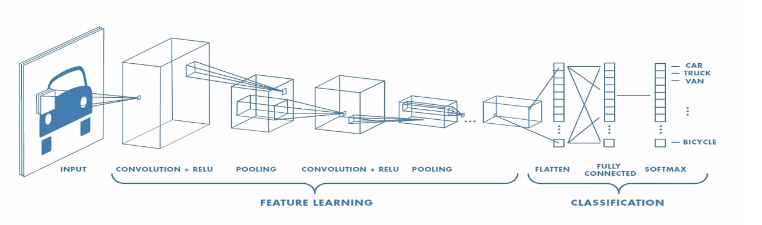

## 1. MNIST 손글씨 훈련 결과 시각화

## 2. MNIST Fashion 에 CNN 적용 후 테스트 결과

기존의 Mnist Fashion 이미지 분류 모델을 CNN 모델로 변경하여 학습 후 테스트 결과를 도출한다.

### 소스 코드

```python
# 기존 모델
model= keras.Sequential()
model.add(keras.layers.Conv2D(32, (3, 3), activation='relu', input_shape=(28, 28, 1)))
model.add(keras.layers.MaxPooling2D((2, 2)))model.add(keras.layers.Conv2D(64, (3, 3), activation='relu'))
model.add(keras.layers.MaxPooling2D((2, 2)))model.add(keras.layers.Conv2D(64, (3, 3), activation='relu'))

# ============================================= #

# CNN 모델 생성 ( 11-03 )
model = keras.Sequential()
model.add(keras.layers.Conv2D(32, (3, 3), activation='relu', input_shape=(28, 28, 1)))
model.add(keras.layers.MaxPooling2D((2, 2)))
model.add(keras.layers.Conv2D(64, (3, 3), activation='relu'))
model.add(keras.layers.MaxPooling2D((2, 2)))
model.add(keras.layers.Conv2D(64, (3, 3), activation='relu'))
# 분류 레이어 추가
model.add(keras.layers.Flatten())
model.add(keras.layers.Dense(64, activation='relu'))
model.add(keras.layers.Dense(10, activation='softmax'))

# 구현 모델 확인
model.summary()
# ============================================= #
# 모델 컴파일
model.compile(optimizer='adam',
              loss='sparse_categorical_crossentropy',
              metrics=['accuracy'])
# optimizer :   모델이 인식하는 데이터와 해당 손실 함수 기반으로 모델이 업데이트 되는 방식
# loss :        훈련 중 모델이 얼마나 정확한 지 측정한다. 이 함수는 최소화 해야함.
# metrics :     훈련 및 테스트 단계를 모니터링 하는 데 사용한다.

# 모델 학습
model.fit(train_images, train_labels, epochs=10)
# ============================================= #
# 모델 평가
test_loss, test_acc = model.evaluate(test_images, test_labels, verbose=2)
print('\n Test accuracy : ', test_acc)
# ============================================= #
```

### CNN 모델

**CNN (Convolutional Neural Networks)**는 딥러닝에서 주로 이미지나 영상 데이터들을 처리할 때 쓰이는 모델이다.
인간의 시신경 구조와 비슷하게 만든 기술인듯 하다.



위의 이미지와 같이 입력 이미지의 특징을 추출하는 부분과 클래스를 분류하는 부분으로 나뉜다.
특징 추출(Feature Learning) 영역은 Convolution Layer와 Pooling Layer를 여러 겹 쌓는 형태로 구성된다.

### 결과


분류할 의류 이미지들이다.


CNN 모델이 정상 적용 된 모습이다.


CNN모델로 10번의 학습을 실시하였다.


학습후 테스트한 시각화 결과이다.
대부분의 의류를 정답에 거의 근사하게 맞췄다.


학습 및 훈련 결과 텍스트이다.
여기서 이상한 점은 학습 시 정확도는 90%인데 예측 값은 100% 이다.
아리송하다. 무슨 이유로 저런 결과값이 나올 수 있는지 궁금하다.

### 고찰

CNN 모델을 적용하고 CNN 모델이 정확히 어떠한 모델인지 찾아보면서 이미지 및 영상처리를 위한 딥러닝 모델이란 것을 알게 됐다.

CNN의 대해 공부하면서 DNN(Deep Neural Network)의 문제점에서 고안되어 나온것이 CNN 이란 것을 알게 됐다.

CNN의 핵심은 이미지나 영상을 그대로 입력받고 공간/지역 정보등을 유지한 채 특성(Feature)들의 계층을 빌드업을 한다. 즉 CNN은 이미지 전체보다는 특정 부분을 보고 입력값의 하나의 픽셀과 주변 픽셀들의 연관성을 보는 거라 생각한다.